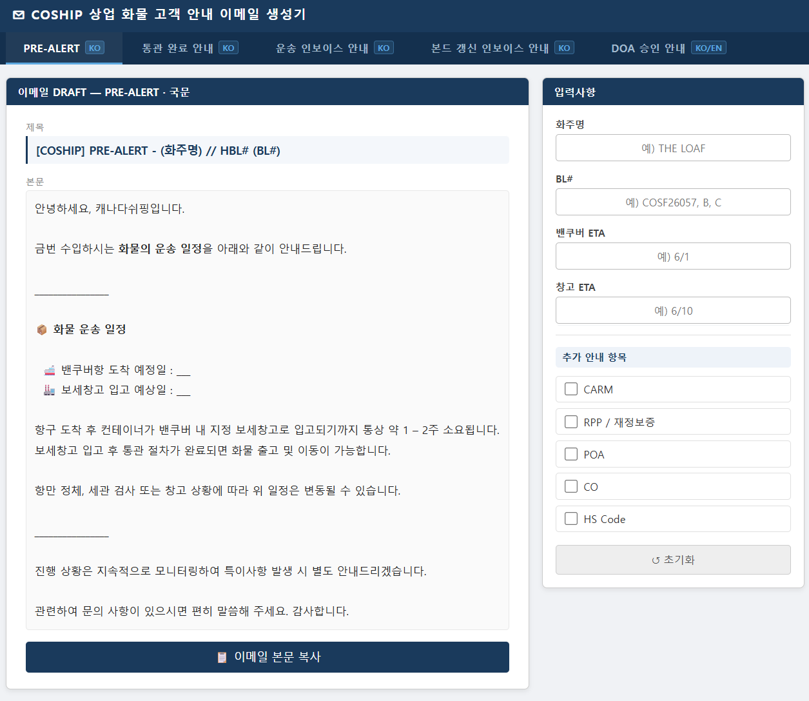
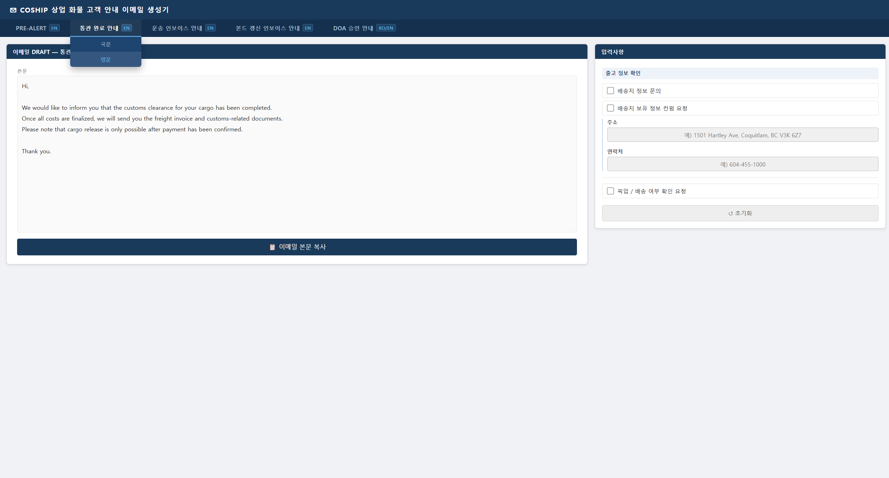
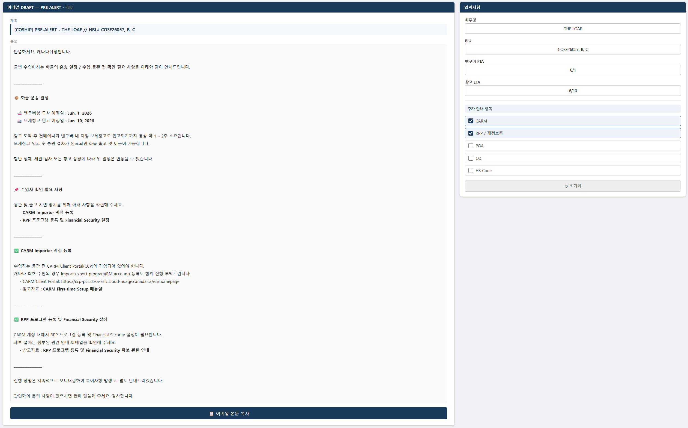
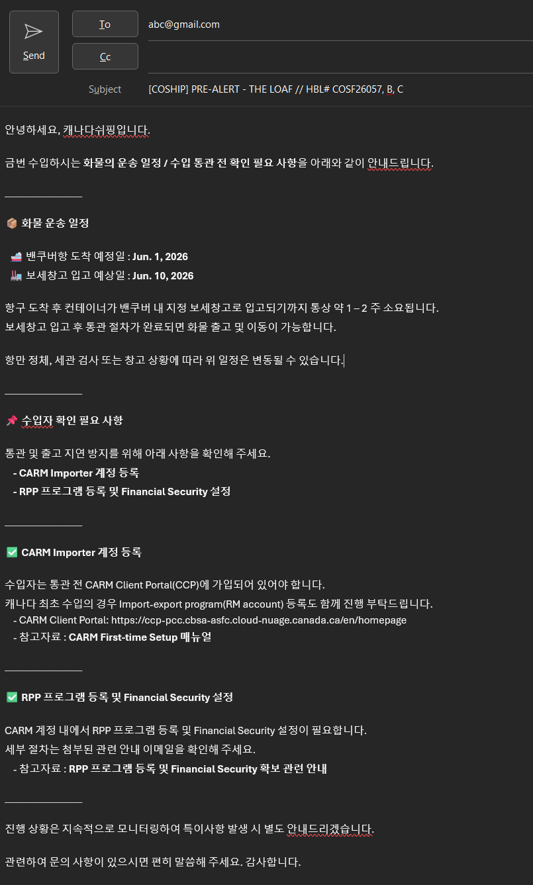

# Email Draft Generator

> 반복적으로 작성되는 포워딩 및 통관 안내 이메일을 표준화하고, Outlook에서 바로 사용할 수 있는 이메일 초안을 빠르게 생성하기 위해 개발한 브라우저 기반 웹 애플리케이션입니다.

---

# 프로젝트 소개

Email Draft Generator는 포워딩 업무에서 반복적으로 작성되는 고객 안내 이메일을 표준화하고, 필요한 정보만 입력하면 Outlook에서 바로 사용할 수 있는 이메일 초안을 생성하는 생산성 도구입니다.

기존에는 이전 이메일을 복사하여 내용을 수정하는 방식으로 업무를 처리했지만, 이 과정에서 반복 입력, 문구의 불일치, 필수 안내 누락 등의 문제가 발생했습니다.

이 프로젝트는 이러한 문제를 해결하기 위해 자주 사용하는 이메일를 템플릿화하고, 운송 정보와 선택한 옵션을 기반으로 이메일를 자동 생성하도록 설계했습니다.

현재는 독립적으로 사용할 수 있는 브라우저 기반 애플리케이션이지만, 향후 **Progress Sheets 자동화 프로젝트와 연계하여 Outlook Draft 자동 생성까지 확장하는 것**을 목표로 설계했습니다.

---

## 프로젝트 한눈에 보기

| Metric | Value |
|--------|------:|
| 이메일 템플릿 | **5종** |
| 지원 언어 | **2개** |
| 주요 자동화 연계 | **2개 예정** |
| Backend | **없음** |
| 실행 환경 | **Browser Only** |
| Outlook 호환 | **HTML Clipboard** |

---

# 프로젝트 하이라이트

- 반복적인 이메일 작성 시간 단축
- 고객 안내 문구 표준화
- 실시간 이메일 Preview
- Outlook 서식(HTML) 유지 복사
- 국문 / 영문 이메일 지원
- 조건부 템플릿 생성
- 브라우저만으로 실행 가능한 경량 구조
- 향후 자동화 프로젝트와 연계 가능한 구조

---

# 개발 배경

포워딩 업무에서는 다음과 같은 이메일를 반복적으로 작성합니다.

- PRE-ALERT
- Customs Completed
- Transportation Invoice
- Bond Renewal
- DOA Approval

각 이메일는 목적은 다르지만 기본적인 구조는 매우 유사하며, 운송 정보만 변경되는 경우가 대부분입니다.

기존 업무 방식은 다음과 같았습니다.

```text
이전 이메일 검색

↓

복사

↓

내용 수정

↓

발송
```

이 과정에서 다음과 같은 문제가 발생했습니다.

- 반복적인 수작업
- 담당자마다 다른 표현 사용
- 필수 안내 누락 가능성
- 이전 이메일 검색 시간
- 국문과 영문 이메일를 각각 작성해야 하는 불편함

Email Draft Generator는 이러한 문제를 해결하기 위해 시작되었습니다.

---

# 개발 목표

본 프로젝트는 이메일 작성 자체를 자동화하는 것이 아니라, **반복 업무를 줄이고 고객 커뮤니케이션을 표준화하는 것**을 목표로 합니다.

주요 목표는 다음과 같습니다.

- 반복 입력 최소화
- 이메일 품질 표준화
- 필수 안내 누락 방지
- 국문 및 영문 이메일 지원
- Outlook 환경 최적화
- 재사용 가능한 템플릿 구조 구축
- 향후 업무 자동화 기반 마련

---

# 주요 기능

## 이메일 템플릿

현재 다음 이메일 유형을 지원합니다.

- PRE-ALERT
- Customs Completed
- Transportation Invoice
- Bond Renewal
- DOA Approval

---

## 실시간 Preview

입력값이 변경되면 이메일가 즉시 다시 생성됩니다.

별도의 생성 버튼 없이 항상 최신 결과를 확인할 수 있습니다.

```text
입력

↓

템플릿 렌더링

↓

Preview 갱신
```

---

## 조건부 안내 문구 생성

체크박스를 통해 필요한 안내만 이메일에 포함할 수 있습니다.

예를 들어

```text
☑ CARM

☑ POA

☐ HS Code
```

를 선택하면

CARM과 POA 안내만 생성됩니다.

---

## Outlook 호환 복사

생성된 이메일는

- HTML
- Plain Text(Fallback)

형식으로 함께 복사됩니다.

이를 통해 Outlook에 붙여넣을 때

- 볼드
- 밑줄
- 줄바꿈
- 문단 구조

를 유지할 수 있습니다.

---

## 국문 / 영문 지원

동일한 운송 정보를 이용하여

- 국문 이메일
- 영문 이메일

를 각각 생성할 수 있습니다.

입력값은 유지한 상태에서 언어만 변경할 수 있으므로 반복 입력을 줄일 수 있습니다.

---

# 업무 흐름

```text
이메일 유형 선택

↓

언어 선택

↓

운송 정보 입력

↓

추가 안내 항목 선택

↓

Preview 확인

↓

Outlook 복사

↓

검토 후 발송
```

본 프로젝트는 자동 발송이 아닌 **이메일 초안 생성**을 목표로 합니다.

담당자의 최종 검토 과정을 유지함으로써 자동화와 정확성을 함께 확보하도록 설계했습니다.

---

# 기술 스택

| 구분 | 기술 |
|------|------|
| Frontend | HTML5 |
| Styling | CSS3 |
| Logic | Vanilla JavaScript |
| Clipboard | Clipboard API |
| Documentation | Markdown |
| Diagram | Mermaid |

---

# 시스템 개요

```text
사용자

↓

Presentation Layer

↓

State Management

↓

Template Engine

↓

Preview Layer

↓

Clipboard Service

↓

Microsoft Outlook
```

별도의 서버나 데이터베이스 없이 모든 기능을 브라우저에서 수행하는 Client-side Architecture를 적용했습니다.

이를 통해 설치 과정 없이 누구나 동일한 환경에서 사용할 수 있으며, 빠른 실행과 간단한 배포가 가능합니다.

보다 자세한 시스템 구조는 **docs/system-architecture.md**에서 확인할 수 있습니다.

---

# 자동화 확장 방향

현재 프로젝트는 독립적인 이메일 생성 도구로 사용할 수 있으며, 장기적으로는 운송 진행 자동화 프로젝트와 연계하는 것을 목표로 합니다.

```text
Progress Sheets

↓

운송 진행 정보

↓

Email Draft Generator

↓

Outlook Draft

↓

담당자 검토

↓

고객 발송
```

향후에는 Progress Sheets 자동화 프로젝트와 연계하여 운송 진행 상황에 따라 필요한 이메일 초안을 자동 생성하는 구조를 계획하고 있습니다.

자동 발송이 아닌 Outlook Draft 생성 방식을 유지하여 담당자의 최종 검토 과정을 보장하는 것을 기본 원칙으로 하고 있습니다.

---

# 프로젝트 화면

## 메인 화면

- 이메일 유형 선택
- 국문 / 영문 전환
- 운송 정보 입력
- 조건부 안내 항목 선택
- 실시간 Preview

<p align="center">
  
</p>

---

## 템플릿 / 언어 설정 메뉴

PRE-ALERT, 통관 완료 안내, 운송 인보이스 안내, 본드 갱신 인보이스 안내, DOA 승인 안내 이메일 템플릿을 지원합니다.

모든 이메일 템플릿은 동일한 입력 데이터를 기반으로 국문과 영문을 자유롭게 전환할 수 있습니다.

<p align="center">
  
</p>

---

## 이메일 드래프트 생성 예시

사용자가 입력한 운송 정보와 선택한 안내 항목을 기반으로 Template Engine이 이메일 제목과 본문을 생성합니다.

생성된 Preview는 Outlook에서 사용할 수 있는 HTML 형식으로 복사할 수 있으며, 국문과 영문 템플릿 모두 동일한 입력 데이터를 재사용합니다.

<p align="center">
  
</p>

---

## Outlook 복사 결과

생성된 이메일를 Outlook에 붙여 넣었을 때 서식이 유지되는 예시입니다.

HTML Clipboard를 사용하여 볼드, 밑줄, 문단 구조를 유지한 상태로 Microsoft Outlook에 붙여넣을 수 있습니다.

<p align="center">
  
</p>

---

# 프로젝트 문서

프로젝트의 설계 과정과 구현 방식은 아래 문서에서 자세히 확인할 수 있습니다.

| 문서 | 설명 |
|------|------|
| **docs/project-background.md** | 프로젝트 개발 배경과 목표 |
| **docs/workflow-overview.md** | 사용자 Workflow 및 기능 흐름 |
| **docs/template-logic.md** | 이메일 생성 로직 및 템플릿 구조 |
| **docs/system-architecture.md** | 시스템 아키텍처 및 설계 원칙 |
| **docs/development-history.md** | 프로젝트의 개발 과정과 개선 이력 |
| **docs/future-roadmap.md** | 향후 개발 계획 및 자동화 방향 |

README에서는 프로젝트를 간략히 소개하며, 세부적인 구현 내용은 각 문서에서 확인할 수 있습니다.

---

# 저장소 구조

```
Email-Draft-Generator
│
├── docs/
│   ├── project-background.md
│   ├── workflow-overview.md
│   ├── template-logic.md
│   ├── system-architecture.md
│   ├── development-history.md
│   └── future-roadmap.md
│
├── screenshots/
│
├── email-draft-generator.html
│
└── README.md
```

---

# 실행 방법

본 프로젝트는 별도의 설치 과정 없이 실행할 수 있습니다.

### 1. 저장소를 Clone합니다.

```bash
git clone https://github.com/schiele19c/logistics-email-draft-generator.git
```

### 2. 프로젝트 폴더를 엽니다.

```bash
cd logistics-email-draft-generator
```

### 3. `index.html`을 브라우저에서 실행합니다.

별도의 패키지 설치나 서버 실행 과정은 필요하지 않습니다.

---

# 프로젝트를 통해 얻은 점

이번 프로젝트를 개발하면서 가장 크게 느낀 점은 **자동화보다 먼저 표준화가 필요하다**는 것이었습니다.

초기에는 반복적인 이메일 작성 시간을 줄이는 것이 목표였지만, 개발을 진행하면서 동일한 업무라도 담당자마다 표현 방식과 안내 순서가 달라질 수 있다는 점을 확인했습니다.

따라서 단순히 이메일를 자동 생성하는 것이 아니라, 자주 사용하는 고객 안내를 템플릿화하고 일관된 형식으로 제공하는 것이 자동화의 기반이라는 점을 배울 수 있었습니다.

또한 Outlook 호환성, 실시간 Preview, 조건부 문단 생성 등 실제 업무 환경에서 사용성을 높이기 위한 기능들을 구현하면서, 사용자 경험을 고려한 설계의 중요성을 다시 한 번 확인할 수 있었습니다.

---

# 연계 프로젝트

Email Draft Generator는 독립적으로 사용할 수 있는 프로젝트이지만, 향후에는 아래 프로젝트와 연계하여 하나의 업무 자동화 Workflow를 구성하는 것을 목표로 하고 있습니다.

### Progress Sheets Automation

운송 진행 정보를 Google Sheets 기반으로 관리하는 자동화 프로젝트입니다.

향후에는 Progress Sheets에서 관리되는 데이터를 이용하여 필요한 이메일 초안을 자동 생성하는 구조를 계획하고 있습니다.

예상되는 Workflow는 다음과 같습니다.

```text
Progress Sheets

↓

Shipment Milestone

↓

Email Draft Generator

↓

Outlook Draft

↓

담당자 검토

↓

고객 발송
```

이를 통해 반복 입력을 최소화하면서도 담당자의 최종 검토 과정을 유지하는 업무 환경을 구축하는 것을 목표로 합니다.

---

# 향후 개발 계획

향후에는 다음 기능을 추가하는 것을 계획하고 있습니다.

- Progress Sheets 자동 연계
- Outlook Draft 자동 생성
- Microsoft Graph API 연동
- n8n Workflow 연계
- Power Automate 연계
- 다국어 지원 확대
- 이메일 템플릿 추가
- 사용자 설정 기능

자세한 내용은 **docs/future-roadmap.md**에서 확인할 수 있습니다.