# Workflow Overview

## 1. 문서 목적

이 문서는 이메일 드래프트 생성기의 전체 사용 흐름과 각 이메일 템플릿의 작동 방식을 설명합니다.

본 앱은 상업 화물 운송 및 통관 업무에서 반복적으로 발생하는 고객 안내 이메일을 빠르고 일관되게 작성하기 위한 웹 기반 도구입니다.

현재 버전에서는 담당자가 직접 입력값을 기입하고 체크박스를 선택하여 이메일 초안을 생성하는 반자동 방식으로 작동합니다.

향후에는 별도로 진행한 Progress Sheets 자동화와 연계하여, 운송 진행 상황 및 주요 일정 마일스톤에 따라 Outlook 이메일 드래프트를 자동 또는 반자동으로 생성하는 구조로 확장하는 것을 염두에 두고 있습니다.

---

## 2. 전체 업무 흐름

현재 앱의 기본 사용 흐름은 다음과 같습니다.


담당자는 상단 탭에서 필요한 이메일 유형을 선택하고, 오른쪽 입력 패널에서 화주명, BL 번호, ETA, 수입자명, 갱신일, 주소, 연락처 등 필요한 정보를 입력합니다.

체크박스를 통해 CARM, RPP, POA, CO, HS Code, 배송, 픽업 등 상황별 추가 안내 항목을 선택하면, 왼쪽 미리보기 영역에 이메일 본문이 실시간으로 생성됩니다.

생성된 이메일은 복사 버튼을 통해 Outlook에 붙여넣어 사용할 수 있습니다.

---

## 3. 화면 구성

앱 화면은 크게 세 영역으로 구성됩니다.

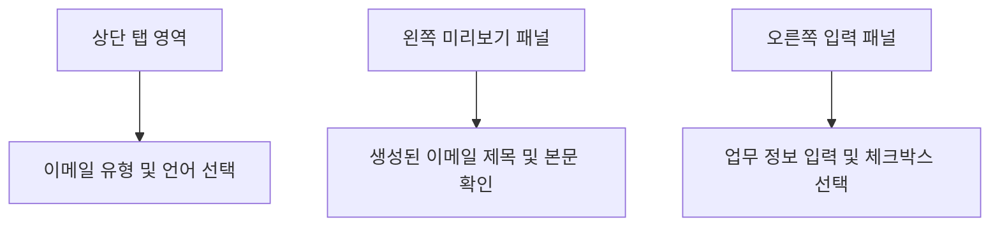

### 3.1 상단 탭 영역

상단 탭 영역에서는 이메일 유형을 선택합니다.

현재 지원하는 주요 탭은 다음과 같습니다.

- PRE-ALERT
- 통관 완료 안내
- 운송 인보이스 안내
- 본드 갱신 인보이스 안내
- DOA 승인 안내

일부 탭은 국문/영문 전환을 지원합니다.

언어 전환 시 입력값은 유지되고, 선택된 언어에 맞는 이메일 템플릿만 다시 렌더링됩니다.

### 3.2 왼쪽 미리보기 패널

왼쪽 패널은 생성된 이메일 초안을 보여주는 영역입니다.

이 영역에서는 다음 내용을 확인할 수 있습니다.

- 이메일 제목
- 이메일 본문
- 선택된 안내 항목이 반영된 문구
- 날짜 및 주요 정보가 적용된 문장
- 볼드, 밑줄, 줄바꿈 등 Outlook 복사용 서식

이메일 히스토리에 회신하는 성격의 템플릿은 제목 없이 본문만 표시되도록 구성되어 있습니다.

### 3.3 오른쪽 입력 패널

오른쪽 패널은 담당자가 필요한 정보를 입력하는 영역입니다.

입력값 예시는 다음과 같습니다.

- 화주명
- BL 번호
- 밴쿠버 ETA
- 창고 ETA
- 수입자명
- 본드 만료/갱신일
- 배송지 주소
- 연락처

체크박스를 통해 상황별 안내 문구를 추가할 수 있습니다.

예를 들어 PRE-ALERT 탭에서는 다음 항목을 선택할 수 있습니다.

- CARM
- RPP / Financial Security
- POA
- CO
- HS Code

---

## 4. 현재 버전의 기본 작동 방식

현재 버전은 사용자의 입력과 선택 상태를 바탕으로 이메일 템플릿을 실시간으로 생성합니다.

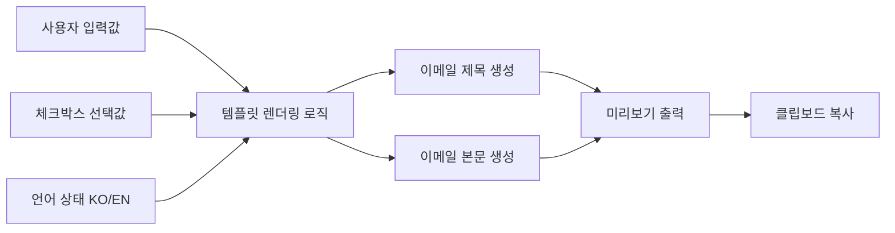

앱은 다음 정보를 조합하여 이메일을 생성합니다.

1. 텍스트 입력값
2. 체크박스 선택 여부
3. 현재 선택된 이메일 유형
4. 현재 선택된 언어
5. 날짜 포맷 변환 로직
6. 이메일별 고정 문구
7. 선택 항목별 추가 안내 문구

예를 들어 PRE-ALERT 템플릿에서는 화주명, BL 번호, ETA 정보를 입력하면 제목과 기본 본문이 자동 생성됩니다.

CARM, RPP, POA, CO, HS Code 중 필요한 항목을 선택하면 해당 안내 문구가 본문 하단에 추가됩니다.

---

## 5. 이메일 템플릿별 워크플로우

## 5.1 PRE-ALERT 워크플로우

PRE-ALERT는 수입 예정 화물의 주요 운송 일정을 고객에게 사전 안내하는 이메일입니다.

### 입력 항목

- 화주명
- BL 번호
- 밴쿠버 ETA
- 창고 ETA

### 선택 항목

- CARM
- RPP / Financial Security
- POA
- CO
- HS Code

### 생성 내용

PRE-ALERT 템플릿은 다음 정보를 포함합니다.

- 이메일 제목
- 수입 예정 화물 안내 문구
- 항만 도착 예정일
- 보세창고 입고 예정일
- 통관 및 입고 이후 진행 관련 안내
- 선택된 필수 확인 항목 안내

### 사용 흐름

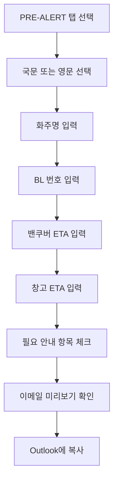

### 업무상 의미

PRE-ALERT는 고객이 화물 도착 전 통관 준비를 할 수 있도록 돕는 중요한 단계입니다.

특히 CARM, RPP, POA, CO, HS Code와 같은 항목은 통관 지연 방지와 수입자 의무 안내에 직접적으로 연결될 수 있습니다.

따라서 PRE-ALERT 템플릿은 단순 일정 안내가 아니라, 수입 진행 전 고객이 준비해야 할 사항을 표준화된 방식으로 전달하는 역할을 합니다.

---

## 5.2 통관 완료 안내 워크플로우

통관 완료 안내는 화물의 통관이 완료된 후, 출고 또는 배송 진행을 위해 고객에게 필요한 정보를 확인하는 이메일입니다.

### 입력 항목

- 주소
- 연락처

### 선택 항목

- 배송지 정보 문의
- 배송지 보유 정보 컨펌 요청
- 픽업 / 배송 여부 확인 요청

### 생성 내용

통관 완료 안내 템플릿은 다음 내용을 포함할 수 있습니다.

- 통관 완료 안내
- 최종 배송지 정보 요청
- 기존 보유 주소 및 연락처 확인 요청
- 픽업 또는 배송 진행 여부 확인 요청
- 확인 후 후속 진행 안내

### 사용 흐름

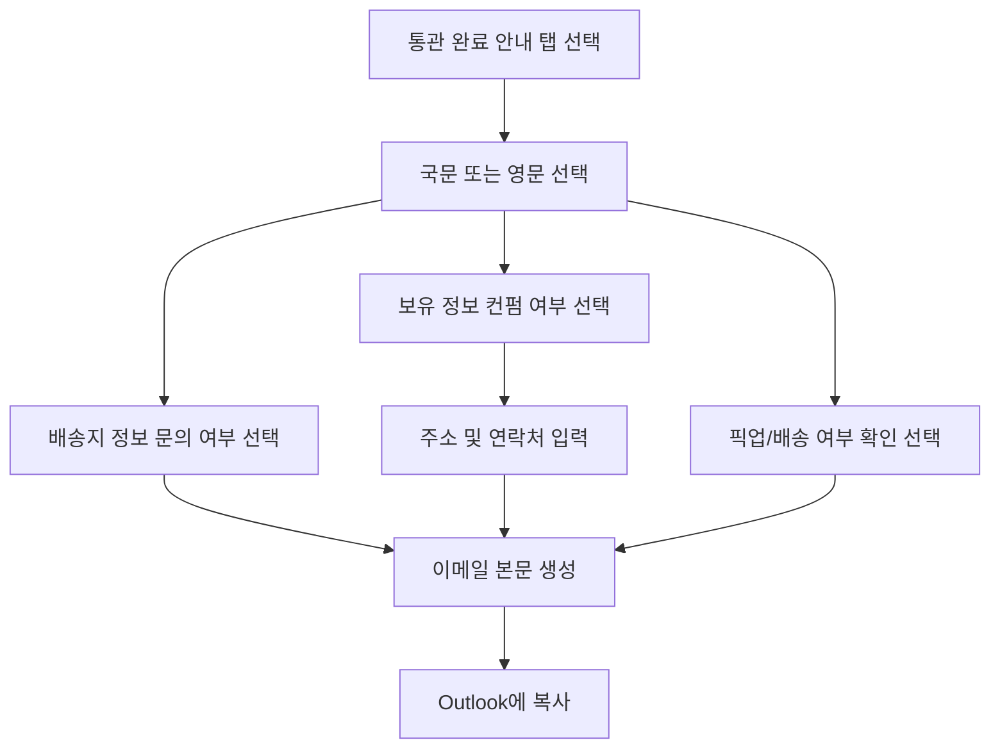

### 업무상 의미

통관 완료 이후에는 화물이 실제로 출고 가능한 상태가 되므로, 고객의 픽업 또는 배송 의사를 빠르게 확인해야 합니다.

배송지 정보가 부정확하거나 연락처가 누락될 경우 출고 지연이 발생할 수 있기 때문에, 이 템플릿은 출고 전 확인 절차를 표준화하는 역할을 합니다.

---

## 5.3 운송 인보이스 안내 워크플로우

운송 인보이스 안내는 고객에게 비용 청구 및 후속 출고 절차를 안내하는 이메일입니다.

### 선택 항목

- 통관 안내
- 배송
- 픽업

### 생성 내용

운송 인보이스 안내 템플릿은 다음 내용을 포함할 수 있습니다.

- 통관 또는 입고 상태 안내
- 인보이스 확인 요청
- 결제 안내
- 배송 진행 안내
- 픽업 진행 안내
- 대금 납부 후 후속 진행 방식 안내

### 사용 흐름

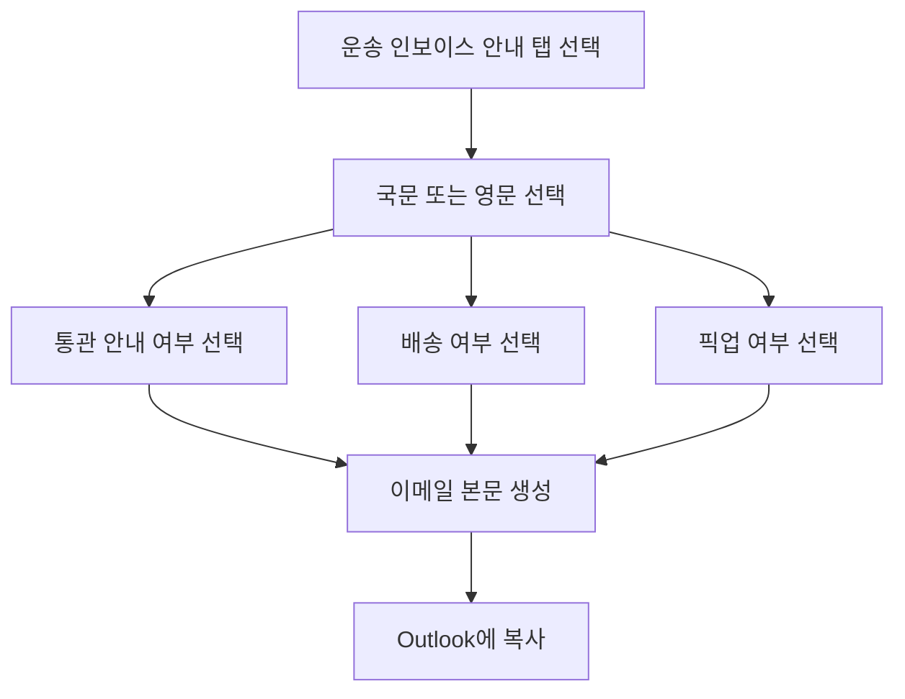

### 업무상 의미

인보이스 안내는 단순 비용 청구를 넘어, 결제 이후 화물이 어떻게 출고되는지 고객에게 명확히 안내하는 단계입니다.

배송 건과 픽업 건은 후속 진행 방식이 다르므로, 체크박스를 통해 상황별 문구를 선택하도록 구성했습니다.

이를 통해 담당자는 고객의 화물 진행 방식에 맞는 안내를 빠르게 작성할 수 있습니다.

---

## 5.4 본드 갱신 인보이스 안내 워크플로우

본드 갱신 인보이스 안내는 기존 본드의 유효 기간 만료 또는 갱신과 관련하여 고객에게 인보이스를 안내하는 이메일입니다.

### 입력 항목

- 수입자명
- 만료/갱신일

### 생성 내용

본드 갱신 인보이스 안내 템플릿은 다음 내용을 포함합니다.

- 이메일 제목
- 본드 만료 또는 갱신 안내
- 인보이스 확인 요청
- 결제 관련 안내
- 갱신 후속 절차 안내

### 사용 흐름

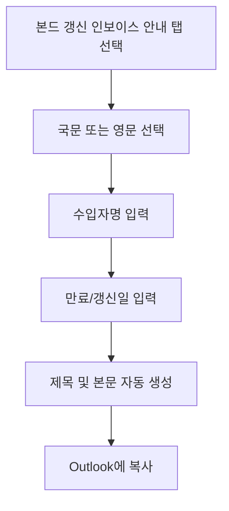

### 업무상 의미

본드 갱신은 수입자의 통관 지속 가능성과 관련된 업무입니다.

갱신 시점, 인보이스, 결제 여부에 대한 안내가 명확하지 않으면 이후 통관 진행에 영향을 줄 수 있습니다.

따라서 본 템플릿은 본드 만료 또는 갱신 일정에 맞춘 고객 안내를 표준화하는 역할을 합니다.

---

## 5.5 DOA 승인 안내 워크플로우

DOA 승인 안내는 통관 업무 위임을 위해 고객이 CARM 또는 관련 시스템에서 승인해야 하는 절차를 안내하는 이메일입니다.

### 입력 항목

현재 버전에서는 별도 입력값 없이 고정된 안내 문구를 제공합니다.

### 생성 내용

DOA 승인 안내 템플릿은 다음 내용을 포함합니다.

- 국문 DOA 승인 안내
- 영문 DOA 승인 안내
- 고객이 승인해야 하는 절차 설명
- 통관 브로커 위임 관련 안내

### 사용 흐름

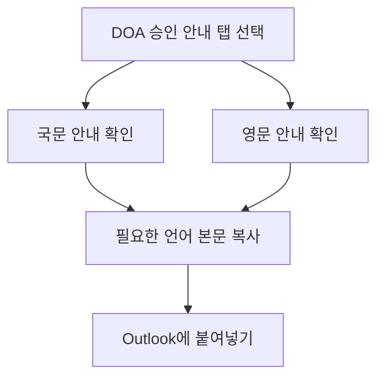

### 업무상 의미

DOA 승인은 통관 브로커가 수입자를 대신해 업무를 수행하기 위한 필수 절차입니다.

고객이 해당 절차를 정확히 이해하지 못하면 통관 진행이 지연될 수 있으므로, 명확하고 반복 사용 가능한 안내 문구가 필요합니다.

---

## 6. Outlook 복사 워크플로우

본 앱의 중요한 기능 중 하나는 생성된 이메일을 Outlook에 붙여넣었을 때 서식이 유지되도록 하는 것입니다.

일반 텍스트만 복사할 경우 볼드, 밑줄, 줄바꿈 등의 서식이 사라질 수 있습니다.

이를 방지하기 위해 앱은 클립보드 복사 시 HTML 형식과 plain text 형식을 함께 처리하는 방식을 사용합니다.

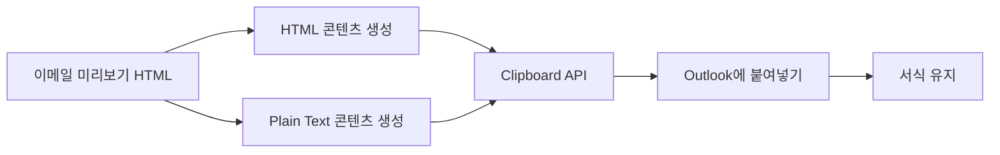

이 방식의 장점은 다음과 같습니다.

- Outlook에 붙여넣을 때 볼드와 밑줄이 유지됩니다.
- 줄바꿈과 문단 구조가 유지됩니다.
- HTML 복사를 지원하지 않는 환경에서는 plain text를 fallback으로 사용할 수 있습니다.
- 담당자는 생성된 이메일을 복사한 뒤 Outlook에서 최종 확인만 하면 됩니다.

---

## 7. 현재 버전과 향후 자동화 버전의 차이

현재 버전은 담당자가 직접 필요한 정보를 입력하는 반자동 도구입니다.

향후에는 Progress Sheets 자동화와 연계하여 시트의 데이터를 이메일 템플릿에 자동으로 반영하는 구조로 확장할 수 있습니다.

## 7.1 현재 버전


현재 버전의 특징은 다음과 같습니다.

- 담당자가 직접 입력값을 관리합니다.
- 이메일 문구와 형식은 앱에서 표준화합니다.
- 최종 발송 전 담당자가 직접 검토합니다.
- 별도 서버나 데이터 연동 없이 사용할 수 있습니다.
- 팀원과 쉽게 공유할 수 있습니다.

## 7.2 향후 Progress Sheets 연계 버전

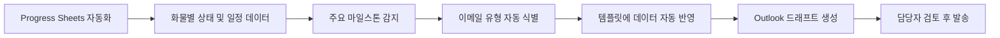

향후 버전의 목표는 다음과 같습니다.

- 시트에 저장된 화물별 정보를 이메일 입력값으로 자동 사용
- 운송 진행 상태에 따라 필요한 이메일 유형 자동 식별
- 주요 일정 마일스톤별 고객 안내 자동화
- Outlook 이메일 드래프트 자동 생성
- 담당자는 최종 검토와 발송만 수행

이 구조는 운송 진행 관리와 고객 커뮤니케이션을 하나의 연속된 자동화 흐름으로 연결하는 것을 목표로 합니다.

---

## 8. Progress Sheets 연계 시 예상 마일스톤

Progress Sheets 자동화와 연계할 경우, 다음과 같은 마일스톤을 이메일 자동화 트리거로 활용할 수 있습니다.

| 마일스톤 | 관련 이메일 템플릿 | 자동화 가능 내용 |
|---|---|---|
| 화물 출발 전 또는 선적 정보 확인 | PRE-ALERT | 화주명, BL 번호, ETA 기반 사전 안내 |
| 밴쿠버 ETA 확인 | PRE-ALERT | 항만 도착 예정일 자동 반영 |
| 창고 ETA 확인 | PRE-ALERT | 보세창고 입고 예정일 자동 반영 |
| 통관 완료 | 통관 완료 안내 | 배송지 정보 확인 또는 픽업/배송 여부 확인 |
| 인보이스 발행 | 운송 인보이스 안내 | 결제 및 후속 출고 안내 |
| 픽업 예정 | 운송 인보이스 안내 / 통관 완료 안내 | 픽업 가능 여부 및 일정 안내 |
| 배송 예정 | 운송 인보이스 안내 / 통관 완료 안내 | 배송 진행 관련 안내 |
| 본드 만료 임박 | 본드 갱신 인보이스 안내 | 갱신일 및 인보이스 안내 |
| DOA 승인 필요 | DOA 승인 안내 | 통관 위임 승인 절차 안내 |

이러한 마일스톤 기반 구조를 통해 고객 안내 이메일이 필요한 시점을 시스템적으로 관리할 수 있습니다.

---

## 9. 향후 자동화 확장 흐름

Progress Sheets 자동화와 이메일 드래프트 생성기를 연계할 경우, 전체 자동화 흐름은 다음과 같이 확장될 수 있습니다.

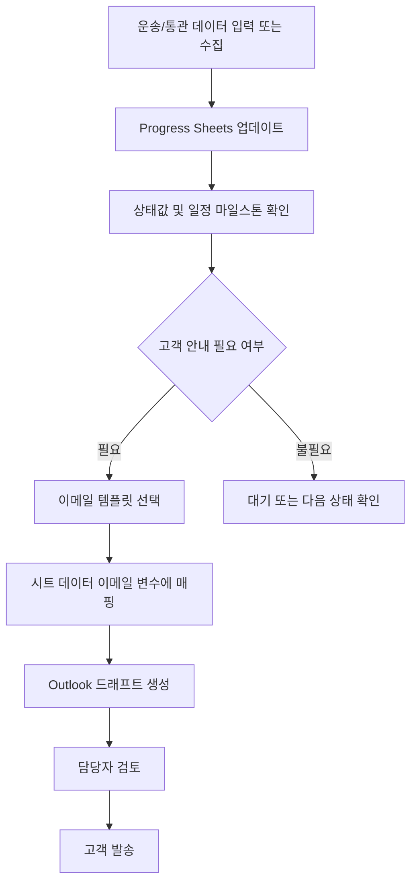

이 방식은 완전 자동 발송보다는, 담당자의 최종 검토를 거치는 반자동 드래프트 생성 방식이 적합합니다.

운송 및 통관 업무에서는 고객별 상황, 예외 사항, 일정 변동, 비용 확인, 내부 승인 여부 등이 존재할 수 있기 때문에, 자동 생성된 이메일을 담당자가 최종 확인한 뒤 발송하는 구조가 안전합니다.

---

## 10. 데이터 매핑 개념

향후 Progress Sheets와 연계할 경우, 시트의 컬럼 데이터를 이메일 템플릿 변수에 매핑할 수 있습니다.

예상 가능한 매핑 예시는 다음과 같습니다.

| Progress Sheets 데이터 | 이메일 템플릿 변수 | 사용 위치 |
|---|---|---|
| Shipper / Exporter | 화주명 | PRE-ALERT 제목 및 본문 |
| House BL# | BL 번호 | PRE-ALERT 제목 |
| Vessel ETA | 밴쿠버 ETA | PRE-ALERT 본문 |
| Warehouse ETA | 창고 ETA | PRE-ALERT 본문 |
| Importer | 수입자명 | 본드 갱신 안내 |
| Delivery Address | 주소 | 통관 완료 안내 |
| Contact Number | 연락처 | 통관 완료 안내 |
| Customs Status | 통관 상태 | 통관 완료 안내 |
| Invoice Status | 인보이스 상태 | 운송 인보이스 안내 |
| Pickup / Delivery Type | 픽업 또는 배송 | 인보이스 및 출고 안내 |
| Bond Expiry Date | 만료/갱신일 | 본드 갱신 인보이스 안내 |
| DOA Status | DOA 승인 상태 | DOA 승인 안내 |

이러한 매핑 구조를 사용하면 이메일 작성에 필요한 주요 정보가 담당자의 수동 입력 없이 자동으로 반영될 수 있습니다.

---

## 11. 반자동 방식을 유지하는 이유

향후 Progress Sheets와 Outlook을 연계하더라도, 고객 이메일을 완전 자동 발송하는 방식보다는 담당자 검토를 거치는 반자동 방식이 적합합니다.

그 이유는 다음과 같습니다.

### 11.1 예외 상황이 많음

운송 및 통관 업무는 일정, 비용, 검사, 창고 입고, 고객 요청 등 예외 상황이 자주 발생합니다.

따라서 자동 생성된 이메일이라도 담당자가 상황에 맞게 최종 확인해야 합니다.

### 11.2 고객별 표현 조정 필요

같은 안내라도 고객의 이해도, 거래 이력, 요청 사항에 따라 표현을 다르게 조정해야 할 수 있습니다.

### 11.3 비용 및 일정 정보의 정확성 검토 필요

인보이스, 배송 일정, 픽업 가능 여부 등은 고객에게 직접적인 영향을 주는 정보이므로 발송 전 검토가 필요합니다.

### 11.4 고객 커뮤니케이션 품질 유지

자동화는 반복 업무를 줄이기 위한 도구이지만, 최종 커뮤니케이션의 책임은 담당자에게 있습니다.

따라서 본 프로젝트의 자동화 방향은 “자동 발송”이 아니라 “검토 가능한 Outlook 드래프트 자동 생성”에 초점을 둡니다.

---

## 12. 사용자 시나리오 예시

## 12.1 PRE-ALERT 작성 시나리오

1. 담당자가 PRE-ALERT 탭을 선택합니다.
2. 화주명과 BL 번호를 입력합니다.
3. 밴쿠버 ETA와 창고 ETA를 입력합니다.
4. 고객에게 필요한 CARM, RPP, POA, CO, HS Code 항목을 선택합니다.
5. 생성된 이메일을 확인합니다.
6. Outlook에 붙여넣고 최종 검토 후 발송합니다.

향후 자동화 연계 시에는 Progress Sheets의 ETA, BL 번호, 화주명 정보가 자동으로 반영될 수 있습니다.

## 12.2 통관 완료 안내 시나리오

1. 담당자가 통관 완료 안내 탭을 선택합니다.
2. 배송지 정보 문의 또는 보유 정보 컨펌 항목을 선택합니다.
3. 필요한 경우 주소와 연락처를 입력합니다.
4. 픽업 또는 배송 여부 확인 문구를 추가합니다.
5. 생성된 본문을 Outlook 회신 이메일에 붙여넣습니다.

향후 자동화 연계 시에는 통관 상태가 완료로 변경된 건을 자동으로 식별하고, 해당 고객에게 필요한 안내 이메일 드래프트를 생성할 수 있습니다.

## 12.3 인보이스 안내 시나리오

1. 담당자가 운송 인보이스 안내 탭을 선택합니다.
2. 통관 안내, 배송, 픽업 중 해당 항목을 선택합니다.
3. 생성된 이메일 본문을 확인합니다.
4. 인보이스 첨부 후 Outlook에서 발송합니다.

향후 자동화 연계 시에는 인보이스 발행 상태 또는 결제 대기 상태와 연결하여 이메일 초안을 자동 생성할 수 있습니다.

## 12.4 본드 갱신 안내 시나리오

1. 담당자가 본드 갱신 인보이스 안내 탭을 선택합니다.
2. 수입자명과 갱신일을 입력합니다.
3. 제목과 본문이 자동 생성됩니다.
4. 인보이스 첨부 후 고객에게 안내합니다.

향후 자동화 연계 시에는 본드 만료일이 가까워진 고객을 자동으로 식별하고, 갱신 안내 이메일 드래프트를 생성할 수 있습니다.

---

## 13. 현재 구조의 장점

현재 구조는 단일 HTML 기반의 경량 웹앱입니다.

이 구조는 다음과 같은 장점이 있습니다.

- 별도 설치 없이 브라우저에서 실행 가능
- 팀원에게 파일 또는 링크 형태로 쉽게 공유 가능
- 서버나 데이터베이스 없이 사용 가능
- 이메일 문구 수정이 빠름
- 템플릿 추가가 비교적 단순함
- 향후 자동화 연계 전 템플릿 로직을 먼저 표준화할 수 있음

특히 현재 버전은 완성된 최종 자동화 시스템이라기보다, 향후 Progress Sheets 및 Outlook 자동화와 연결하기 위한 이메일 템플릿 엔진의 초기 형태로 볼 수 있습니다.

---

## 14. 향후 구조 확장 방향

향후 프로젝트가 확장될 경우, 다음과 같은 구조로 발전할 수 있습니다.

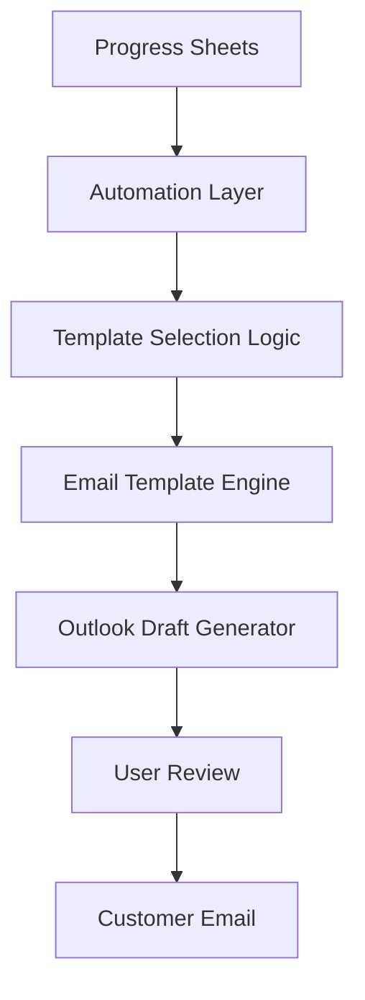

각 구성 요소의 역할은 다음과 같습니다.

| 구성 요소 | 역할 |
|---|---|
| Progress Sheets | 화물별 진행 상황과 주요 일정 데이터 관리 |
| Automation Layer | 상태 변화 및 마일스톤 감지 |
| Template Selection Logic | 상황에 맞는 이메일 유형 선택 |
| Email Template Engine | 입력값과 템플릿을 조합해 이메일 본문 생성 |
| Outlook Draft Generator | 담당자가 검토할 수 있는 이메일 초안 생성 |
| User Review | 담당자의 최종 검토 및 수정 |
| Customer Email | 고객에게 발송되는 최종 안내 |

이 구조를 통해 단순한 이메일 작성 도구에서, 운송 진행 관리와 고객 커뮤니케이션을 연결하는 실무 자동화 시스템으로 발전할 수 있습니다.

---

## 15. 요약

본 이메일 드래프트 생성기의 워크플로우는 이메일 유형 선택, 정보 입력, 추가 안내 항목 선택, 실시간 미리보기, Outlook 복사로 구성됩니다.

현재 버전은 담당자가 직접 정보를 입력하고 생성된 이메일을 검토하는 반자동 방식입니다.

이 방식은 실무 상황에서 필요한 유연성을 유지하면서도, 반복 이메일 작성 시간을 줄이고 고객 안내 품질을 표준화할 수 있다는 장점이 있습니다.

향후에는 Progress Sheets 자동화와 연계하여, 운송 및 통관 진행 상황의 주요 마일스톤에 따라 필요한 Outlook 이메일 드래프트를 자동 생성하는 구조로 확장할 수 있습니다.

따라서 본 프로젝트는 단순한 이메일 템플릿 도구가 아니라, 운송 진행 데이터 관리와 고객 커뮤니케이션 자동화를 연결하기 위한 기반 모듈로 볼 수 있습니다.
```