# Template Logic

## 1. 문서 목적

이 문서는 이메일 드래프트 생성기의 핵심 템플릿 처리 로직과 사용자 입력이 이메일 제목 및 본문으로 변환되는 과정을 설명합니다.

본 앱은 HTML, CSS, Vanilla JavaScript로 구성된 단일 파일 기반 웹앱입니다. 사용자가 텍스트 입력값과 체크박스를 조작하면 JavaScript가 선택된 이메일 유형과 언어에 맞는 템플릿을 즉시 다시 생성하고, 결과를 화면의 미리보기 패널에 출력합니다.

현재 버전은 다음과 같은 핵심 로직으로 구성됩니다.

- 이메일 유형별 탭 전환
- 탭별 국문/영문 상태 관리
- 입력값 실시간 수집
- 체크박스 선택 상태 확인
- 이메일 제목 및 본문 동적 생성
- 날짜 형식 변환
- 조건부 안내 문구 삽입
- Outlook 호환 HTML 클립보드 복사
- 구형 브라우저용 fallback 복사
- 탭별 입력값 초기화
- 화면 폭이 좁은 환경을 위한 탭 바 드래그

본 문서에서는 코드 전체를 줄 단위로 나열하기보다, 프로젝트를 구성하는 주요 로직과 데이터 흐름, 설계 의도 및 향후 확장 구조를 중심으로 설명합니다.

---

## 2. 전체 템플릿 처리 구조

앱의 기본 처리 흐름은 다음과 같습니다.

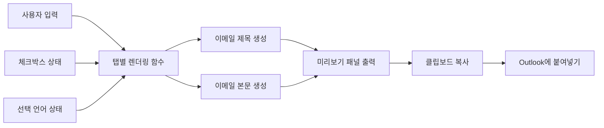

사용자의 입력이나 체크박스 상태가 변경될 때마다 해당 탭의 렌더링 함수가 호출됩니다.

렌더링 함수는 다음 정보를 조합합니다.

1. 현재 선택된 이메일 유형
2. 현재 선택된 언어
3. 텍스트 입력 필드의 값
4. 체크박스 선택 여부
5. 이메일 유형별 고정 문구
6. 선택 항목별 추가 문구
7. 날짜 포맷 변환 결과

결과는 이메일 제목 영역과 본문 영역의 DOM에 반영됩니다.

---

## 3. 현재 프로젝트 구조

현재 버전은 HTML, CSS, Vanilla JavaScript를 하나의 HTML 파일에서 관리하는 구조로 구현했습니다.

단일 파일 구조를 선택함으로써 별도의 설치 과정 없이 브라우저에서 즉시 실행할 수 있도록 구성했습니다.

프로젝트 구조와 계층 설계에 대한 자세한 내용은 **system-architecture.md**에서 설명합니다.

---

## 4. 주요 DOM 구성

각 이메일 탭은 일반적으로 다음 세 영역으로 구성됩니다.

### 4.1 탭 버튼

이메일 유형을 전환하는 상단 버튼입니다.

예시 개념 구조:

```html
<div class="tab-group">
  <button class="tab-btn">
    PRE-ALERT
    <span class="lang-badge">KO</span>
  </button>

  <div class="lang-dropdown">
    <button class="lang-btn">국문</button>
    <button class="lang-btn">영문</button>
  </div>
</div>
```

각 탭에는 고유한 식별자가 있으며, 버튼 클릭 시 해당 이메일 패널만 활성화됩니다.

### 4.2 미리보기 패널

생성된 이메일 제목과 본문을 표시합니다.

일부 이메일은 제목과 본문을 모두 제공하고, 기존 이메일에 회신하는 형태의 안내는 본문만 제공합니다.

예시 개념 구조:

```html
<div class="preview-panel">
  <div class="panel-header">이메일 DRAFT</div>

  <div class="email-wrap">
    <div class="email-subject"></div>
    <div class="email-body"></div>
    <button class="copy-btn">이메일 본문 복사</button>
  </div>
</div>
```

### 4.3 입력 패널

사용자가 이메일에 반영할 정보를 입력하거나 선택하는 영역입니다.

예시:

```html
<div class="input-panel">
  <input type="text" />
  <input type="checkbox" />
  <button class="reset-btn">초기화</button>
</div>
```

입력 필드에는 `oninput`, 체크박스에는 `onchange` 이벤트가 연결되어 있어 사용자 조작 시 즉시 이메일을 다시 생성합니다.

---

## 5. 상태 관리

Template Engine은 현재 입력 상태를 기반으로 이메일를 생성합니다.

관리되는 주요 상태는 다음과 같습니다.

| State | Description |
|--------|-------------|
| Current Language | 국문 / 영문 |
| Input Values | 사용자 입력 |
| Checkbox States | 선택 옵션 |

사용자가 입력값을 변경하면 현재 상태를 기반으로 해당 Template Renderer가 다시 실행됩니다.

상태 관리 방식과 설계 배경은 **system-architecture.md**에서 설명합니다.

---

## 6. 공통 유틸리티 함수

중복되는 DOM 접근과 문자열 처리를 줄이기 위해 공통 유틸리티 함수를 사용합니다.

### 6.1 입력값 조회

```js
function val(id) {
  return document.getElementById(id).value.trim();
}
```

역할:

- 지정된 입력 필드의 값을 가져옴
- 앞뒤 공백 제거
- 모든 템플릿 함수에서 동일한 방식으로 입력값 처리

### 6.2 HTML 특수문자 이스케이프

```js
function esc(s) {
  return s
    .replace(/&/g, '&amp;')
    .replace(/</g, '&lt;')
    .replace(/>/g, '&gt;');
}
```

역할:

- 사용자가 입력한 문자열이 HTML 태그로 해석되는 것을 방지
- 미리보기 본문에 입력값을 삽입할 때 안전성 향상
- `<`, `>`, `&` 문자를 HTML 엔티티로 변환

### 6.3 체크박스 상태 조회

```js
function checked(id) {
  return document.getElementById(id).checked;
}
```

역할:

- 지정된 체크박스의 선택 여부 반환
- 조건부 문구 생성 시 사용

### 6.4 공통 함수 흐름

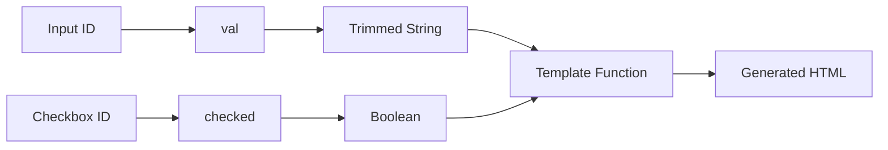

---

## 7. 날짜 변환 로직

사용자가 간단하게 `6/1`과 같은 형식으로 입력하면 이메일 문장에 적합한 날짜 형식으로 자동 변환합니다.

현재 앱에는 용도별로 세 가지 날짜 포맷 함수가 있습니다.

### 7.1 영문 월 약어와 마침표를 사용하는 날짜

예시:

```text
6/1 → Jun. 1, 2026
```

이 포맷은 일부 국문 이메일에서 영문식 일정 표기를 사용할 때 적용됩니다.

```js
function fmtDate(raw) {
  if (!raw) return '___';

  const months = [
    'Jan.', 'Feb.', 'Mar.', 'Apr.',
    'May', 'Jun.', 'Jul.', 'Aug.',
    'Sep.', 'Oct.', 'Nov.', 'Dec.'
  ];

  const parts = raw.split('/');

  if (parts.length === 2) {
    const month = parseInt(parts[0]);
    const day = parseInt(parts[1]);

    if (
      month >= 1 &&
      month <= 12 &&
      day >= 1 &&
      day <= 31
    ) {
      return `${months[month - 1]} ${day}, 2026`;
    }
  }

  return raw;
}
```

### 7.2 영문 날짜

예시:

```text
6/1 → Jun 1, 2026
```

```js
function fmtDateEn(raw) {
  if (!raw) return '___';

  const months = [
    'Jan', 'Feb', 'Mar', 'Apr',
    'May', 'Jun', 'Jul', 'Aug',
    'Sep', 'Oct', 'Nov', 'Dec'
  ];

  const parts = raw.split('/');

  if (parts.length === 2) {
    const month = parseInt(parts[0]);
    const day = parseInt(parts[1]);

    if (
      month >= 1 &&
      month <= 12 &&
      day >= 1 &&
      day <= 31
    ) {
      return `${months[month - 1]} ${day}, 2026`;
    }
  }

  return raw;
}
```

### 7.3 국문 월일 날짜

예시:

```text
7/1 → 7월 1일
```

```js
function fmtDateKo(raw) {
  if (!raw) return '___';

  const parts = raw.split('/');

  if (parts.length === 2) {
    const month = parseInt(parts[0]);
    const day = parseInt(parts[1]);

    if (
      month >= 1 &&
      month <= 12 &&
      day >= 1 &&
      day <= 31
    ) {
      return `${month}월 ${day}일`;
    }
  }

  return raw;
}
```

### 7.4 날짜 처리 흐름

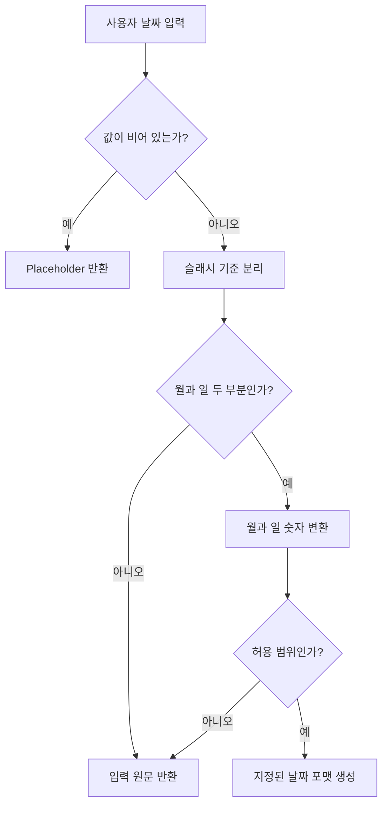

### 7.5 현재 구조의 한계

현재 날짜 포맷에는 연도가 코드에 고정되어 있습니다.

따라서 장기 운영을 위해서는 다음 개선이 필요합니다.

- 현재 연도를 자동으로 조회
- 연도 입력 필드 추가
- `Date` 객체 기반 유효성 검사
- 존재하지 않는 날짜 검증
- `2/31`과 같은 값 차단
- 지역별 날짜 포맷 설정

향후 개선 예시는 다음과 같습니다.

```js
const currentYear = new Date().getFullYear();
```

Progress Sheets와 연결할 경우 시트의 날짜 데이터를 직접 전달받아 포맷하는 방식이 더 적합합니다.

---

## 8. 탭 전환 로직

탭 전환 함수는 다음 작업을 수행합니다.

1. 모든 탭 콘텐츠의 활성 상태 제거
2. 모든 탭 버튼의 활성 상태 제거
3. 선택된 탭 콘텐츠 활성화
4. 선택된 탭 버튼 활성화
5. 해당 탭의 렌더링 함수 호출

개념적 구조:

```js
function switchTab(tabId, tabBtn) {
  document
    .querySelectorAll('.tab-content')
    .forEach(element => element.classList.remove('active'));

  document
    .querySelectorAll('.tab-btn')
    .forEach(element => element.classList.remove('active'));

  document
    .getElementById(`tab-${tabId}`)
    .classList.add('active');

  tabBtn.classList.add('active');

  const renderers = {
    'pre-alert': updatePA,
    'customs': updateCU,
    'invoice': updateINV,
    'bond': updateBOND,
    'doa': updateDOA
  };

  renderers[tabId]();
}
```

### 8.1 탭 전환 흐름

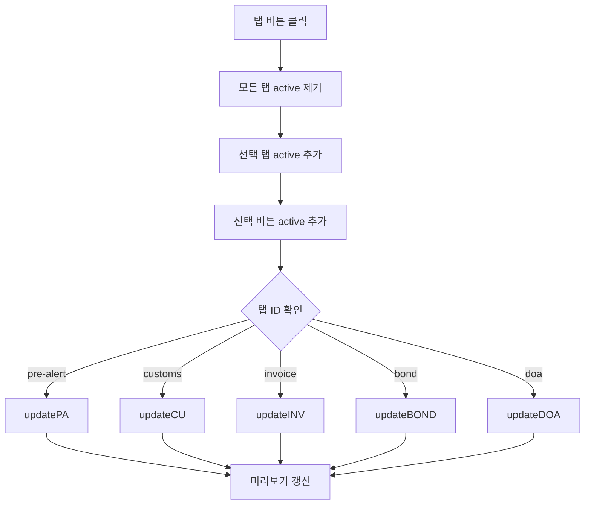

렌더링 함수 매핑 객체를 사용함으로써 다수의 `if` 또는 `switch` 구문을 작성하지 않고 탭별 함수를 호출합니다.

---

## 9. 언어 전환 로직

언어 선택 함수는 다음 작업을 수행합니다.

1. 해당 탭의 언어 상태 갱신
2. 탭의 KO/EN 배지 갱신
3. 언어 드롭다운 버튼 활성 상태 변경
4. 해당 탭 재렌더링

개념적 구조:

```js
function selectLang(tabId, lang, langBtn) {
  tabLang[tabId] = lang;

  document
    .getElementById(`badge-${tabId}`)
    .textContent = lang === 'ko' ? 'KO' : 'EN';

  langBtn
    .closest('.lang-dropdown')
    .querySelectorAll('.lang-btn')
    .forEach(button => button.classList.remove('active'));

  langBtn.classList.add('active');

  const tabBtn = langBtn
    .closest('.tab-group')
    .querySelector('.tab-btn');

  switchTab(tabId, tabBtn);
}
```

### 9.1 언어 전환 흐름

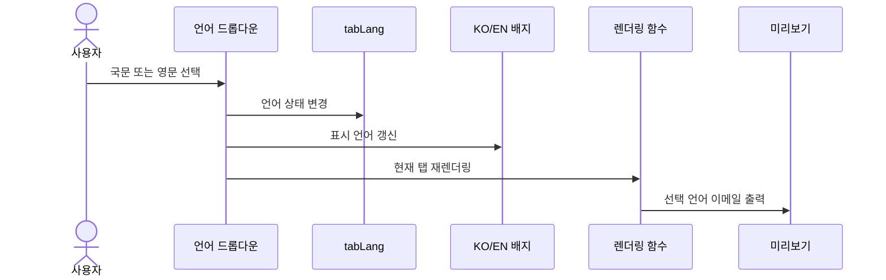

입력값은 DOM에 그대로 남아 있으므로 언어 전환 시 손실되지 않습니다.

---

## 10. 탭별 렌더링 함수 구조

각 이메일 유형은 공통 진입 함수와 언어별 렌더링 함수로 구분됩니다.

예시:

```js
function updatePA() {
  if (tabLang['pre-alert'] === 'ko') {
    updatePA_KO();
  } else {
    updatePA_EN();
  }
}
```

다른 이메일 유형도 같은 방식으로 구성할 수 있습니다.

```text
updatePA()
├─ updatePA_KO()
└─ updatePA_EN()

updateCU()
├─ updateCU_KO()
└─ updateCU_EN()

updateINV()
├─ updateINV_KO()
└─ updateINV_EN()

updateBOND()
├─ updateBOND_KO()
└─ updateBOND_EN()

updateDOA()
├─ 국문 본문 생성
└─ 영문 본문 생성
```

### 10.1 렌더링 함수의 공통 처리 순서

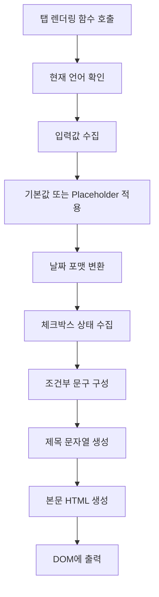

---

## 11. PRE-ALERT 템플릿 로직

PRE-ALERT는 현재 앱에서 가장 많은 입력값과 조건부 항목을 사용하는 템플릿입니다.

### 11.1 입력값

- 화주명
- BL 번호
- 밴쿠버 ETA
- 창고 ETA

### 11.2 선택 항목

- CARM
- RPP / Financial Security
- POA
- Certificate of Origin
- HS Code

### 11.3 제목 생성

제목은 화주명과 BL 번호를 조합하여 생성합니다.

개념 예시:

```js
const shipper = val('pa-shipper') || '(화주명)';
const bl = val('pa-bl') || '(BL#)';

const subject =
  `[COMPANY] PRE-ALERT - ${shipper} // HBL# ${bl}`;
```

입력값이 비어 있으면 사용자가 어떤 값을 입력해야 하는지 알 수 있도록 placeholder 텍스트가 출력됩니다.

### 11.4 조건부 항목 처리

선택된 항목은 두 종류의 콘텐츠로 사용됩니다.

1. 필수 확인 사항 요약 목록
2. 항목별 상세 설명 블록

개념 예시:

```js
const summaryItems = [];
const detailBlocks = [];

if (checked('chk-pa-carm')) {
  summaryItems.push('CARM 계정 등록');
  detailBlocks.push('CARM 상세 안내 문구');
}

if (checked('chk-pa-rpp')) {
  summaryItems.push('RPP 및 Financial Security 설정');
  detailBlocks.push('RPP 상세 안내 문구');
}
```

### 11.5 PRE-ALERT 데이터 흐름

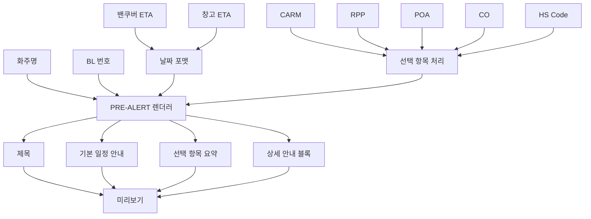

### 11.6 설계상 특징

PRE-ALERT 렌더링 로직은 고정된 전체 문장을 여러 개 나열하는 방식이 아니라, 기본 본문과 선택 항목별 블록을 조합하는 방식입니다.

이로 인해 다음과 같은 장점이 있습니다.

- 고객 상황에 필요한 항목만 포함 가능
- 필수 안내 누락 가능성 감소
- 국문/영문 구조를 유사하게 유지 가능
- 항목을 추가하거나 제거하기 쉬움
- 향후 Progress Sheets 컬럼과 매핑 가능

---

## 12. 통관 완료 안내 템플릿 로직

통관 완료 안내는 체크박스 상태에 따라 주소 및 연락처 입력 필드의 활성화 여부가 변경됩니다.

### 12.1 선택 항목

- 배송지 정보 문의
- 보유 배송지 정보 확인
- 픽업/배송 여부 확인

### 12.2 조건부 입력 필드

보유 정보 컨펌 요청이 선택되면 주소와 연락처 입력 필드가 활성화됩니다.

개념 예시:

```js
function toggleSubInputs() {
  const enabled = checked('chk-cu-confirm');

  document.getElementById('cu-address').disabled = !enabled;
  document.getElementById('cu-phone').disabled = !enabled;
}
```

### 12.3 상호 배타적 선택

배송지 정보 문의와 보유 정보 컨펌 요청은 업무상 동시에 사용하지 않는 것이 자연스러울 수 있습니다.

현재 코드 구조에 따라 두 항목을 동시에 선택할 수 있다면 향후 다음 방식으로 개선할 수 있습니다.

- 체크박스를 라디오 버튼으로 변경
- 하나를 선택하면 다른 항목 자동 해제
- 충돌하는 조합에 경고 표시

### 12.4 통관 안내 처리 흐름

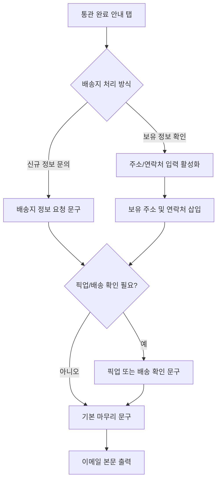

---

## 13. 운송 인보이스 안내 템플릿 로직

운송 인보이스 안내는 입력값보다 체크박스 조합이 중심이 되는 템플릿입니다.

### 13.1 선택 항목

- 통관 최초 안내
- 배송
- 픽업

### 13.2 조건부 조합

각 체크박스는 이메일의 특정 문단을 제어합니다.

개념 예시:

```js
const sections = [];

if (checked('chk-inv-customs')) {
  sections.push('통관 및 입고 완료 안내 문구');
}

sections.push('인보이스 및 결제 안내 기본 문구');

if (checked('chk-inv-delivery')) {
  sections.push('배송 진행 안내 문구');
}

if (checked('chk-inv-pickup')) {
  sections.push('픽업 진행 안내 문구');
}
```

### 13.3 템플릿 조합 흐름

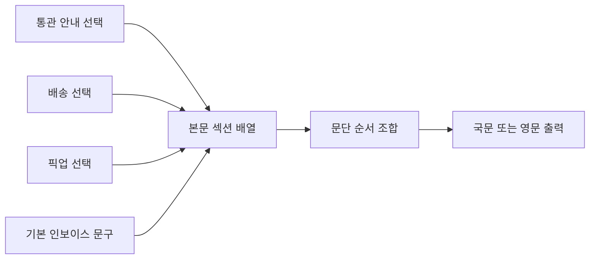

배송과 픽업이 동시에 선택될 수 있다면 실제 업무 규칙에 따라 다음 개선을 고려할 수 있습니다.

- 배송/픽업 중 하나만 선택 가능하도록 제한
- 동시 선택 시 경고 표시
- 혼합 진행에 해당하는 별도 문구 제공

---

## 14. 본드 갱신 인보이스 템플릿 로직

본드 갱신 안내는 수입자명과 만료 또는 갱신일을 이용해 제목과 본문을 생성합니다.

### 14.1 입력값

- 수입자명
- 만료/갱신일

### 14.2 국문과 영문 날짜 차이

국문 본문에서는 다음과 같은 형식을 사용할 수 있습니다.

```text
7/1 → 7월 1일
```

영문 본문에서는 다음 형식을 사용합니다.

```text
7/1 → Jul 1, 2026
```

### 14.3 제목 및 본문 처리

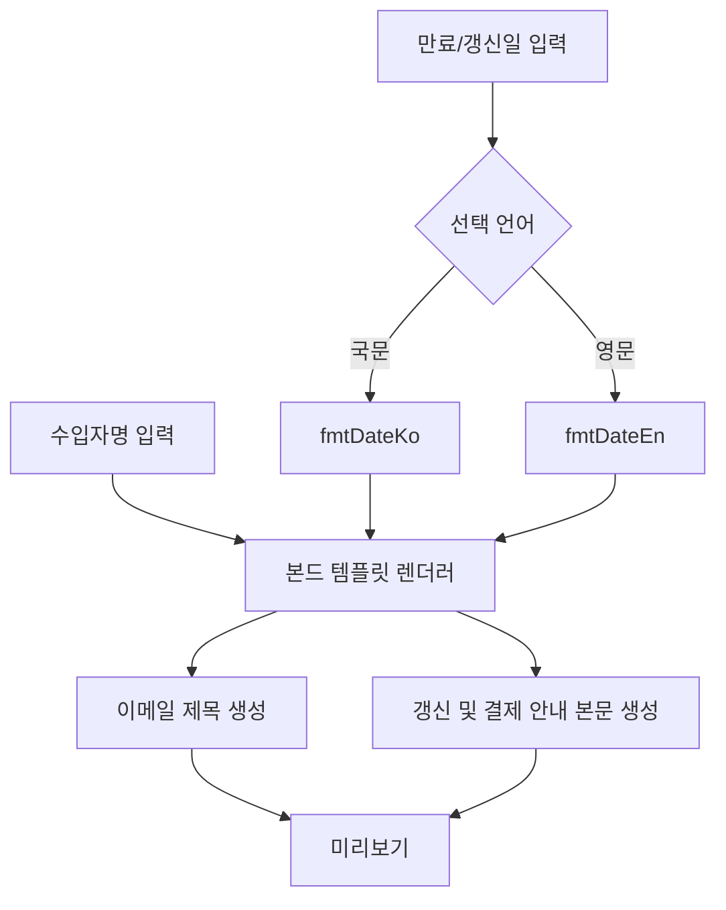

### 14.4 초기화

본드 탭의 초기화 함수는 수입자명과 날짜 필드의 값을 비운 뒤 렌더링 함수를 다시 호출합니다.

```js
function resetBOND() {
  [
    'bond-importer',
    'bond-date'
  ].forEach(id => {
    document.getElementById(id).value = '';
  });

  updateBOND();
}
```

---

## 15. DOA 승인 안내 템플릿 로직

DOA 승인 안내는 다른 탭과 달리 사용자 입력값을 요구하지 않습니다.

국문과 영문 안내를 동시에 출력하고, 각 본문을 독립적으로 복사할 수 있도록 구성합니다.

### 15.1 구조적 차이

일반 탭:

```text
미리보기 패널 + 입력 패널
```

DOA 탭:

```text
국문 미리보기 패널 + 영문 미리보기 패널
```

### 15.2 처리 흐름

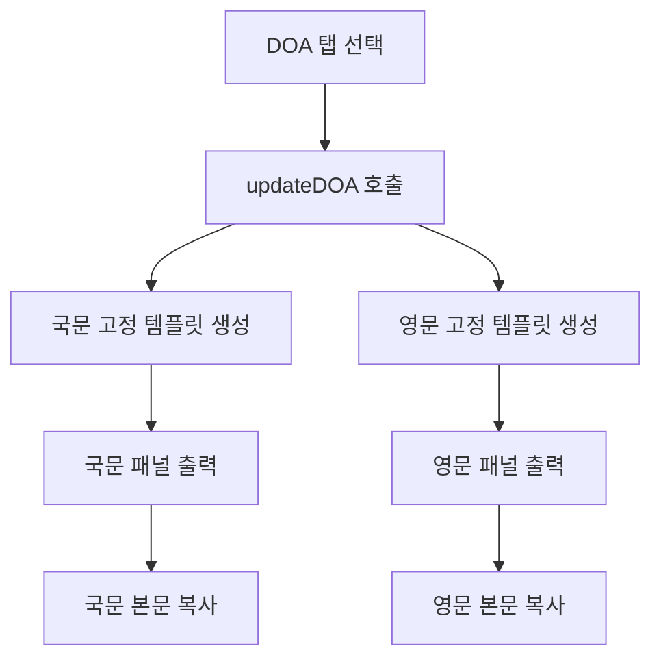

### 15.3 고정 템플릿의 장점

- 사용자 입력 실수 없음
- 승인 절차를 일관되게 안내
- 국문과 영문을 동시에 비교 가능
- 고객 언어에 맞는 본문을 즉시 복사 가능

### 15.4 향후 개선 방향

DOA 승인 안내는 현재 고정된 국문 및 영문 문구를 제공하지만, 향후에는 템플릿의 재사용성과 유지보수성을 높이기 위해 다음과 같이 개선할 수 있습니다.

- 회사명과 통관 브로커명을 설정값으로 분리
- 담당자명과 연락 정보를 템플릿 변수로 처리
- 고객 또는 업무 유형별 안내 문구 선택 기능 추가
- 템플릿 데이터를 별도 JSON 파일로 분리
- Progress Sheets의 고객 및 진행 정보와 자동 매핑
- Outlook 드래프트 생성 시 관련 데이터 자동 반영

이와 같은 구조를 적용하면 동일한 템플릿 엔진을 다양한 고객, 업무 유형 및 자동화 환경에서 재사용할 수 있습니다.

---

## 16. 체크박스 UI 처리

체크박스를 선택하면 단순히 입력 요소의 상태만 변경되는 것이 아니라, 체크박스를 감싸는 라벨의 스타일도 함께 변경됩니다.

개념 예시:

```js
function toggleCheck(labelId) {
  const label = document.getElementById(labelId);
  const checkbox = label.querySelector('input');

  label.classList.toggle(
    'checked',
    checkbox.checked
  );
}
```

### 16.1 시각적 처리 흐름

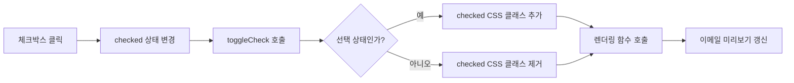

이 방식은 사용자가 어떤 항목을 선택했는지 명확하게 인지할 수 있도록 합니다.

---

## 17. 이메일 제목과 본문 출력 방식

이메일 제목은 일반 텍스트로 출력합니다.

```js
subjectElement.textContent = generatedSubject;
```

이메일 본문은 볼드, 밑줄, 들여쓰기 등의 서식이 필요하므로 HTML로 출력합니다.

```js
bodyElement.innerHTML = generatedBody;
```

### 17.1 `textContent`와 `innerHTML`의 구분

| 출력 대상 | 사용 속성 | 이유 |
|---|---|---|
| 제목 | `textContent` | HTML 해석이 필요하지 않음 |
| 본문 | `innerHTML` | 볼드, 밑줄, 줄바꿈 등 서식 필요 |
| 사용자 입력값 | `esc()` 후 삽입 | HTML 삽입 위험 감소 |

### 17.2 출력 처리 흐름

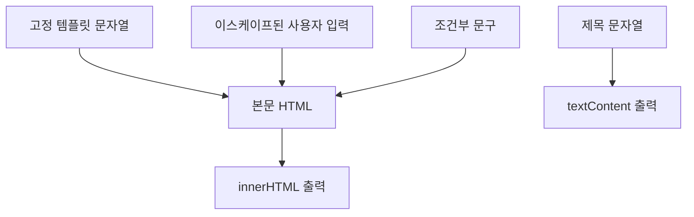

---

## 18. Outlook 호환 클립보드 복사

일반적인 `innerText` 복사 방식은 Outlook에 붙여넣을 때 볼드, 밑줄, 문단 등의 서식을 유지하지 못할 수 있습니다.

이를 해결하기 위해 앱은 다음 두 형식을 동시에 클립보드에 저장합니다.

- `text/html`
- `text/plain`

### 18.1 복사 로직 개념

```js
function copyEmail(subjectId, bodyId) {
  const subjectElement = subjectId
    ? document.getElementById(subjectId)
    : null;

  const bodyElement =
    document.getElementById(bodyId);

  const subjectText = subjectElement
    ? subjectElement.textContent
    : '';

  const htmlContent =
    `<div>` +
    bodyElement.innerHTML.replace(/\n/g, '<br>') +
    `</div>`;

  const plainText =
    bodyElement.innerText;

  const item = new ClipboardItem({
    'text/html': new Blob(
      [htmlContent],
      { type: 'text/html' }
    ),
    'text/plain': new Blob(
      [plainText],
      { type: 'text/plain' }
    )
  });

  navigator.clipboard.write([item]);
}
```

### 18.2 복사 처리 흐름

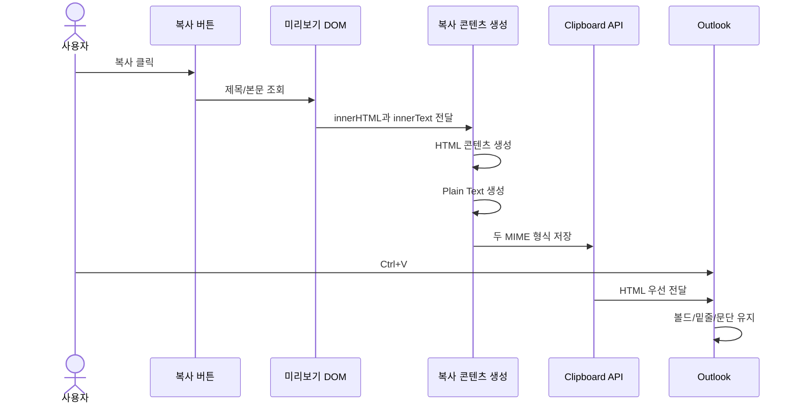

### 18.3 두 형식을 함께 사용하는 이유

HTML만 제공할 경우 HTML 클립보드를 지원하지 않는 환경에서 복사가 실패할 수 있습니다.

plain text를 함께 제공하면 다음과 같은 호환성을 확보할 수 있습니다.

- Outlook에서는 HTML 서식 유지
- 단순 텍스트 편집기에서는 일반 텍스트 사용
- HTML 미지원 환경에서 대체 데이터 제공
- 브라우저 간 호환성 향상

---

## 19. Fallback 복사 로직

`ClipboardItem`을 지원하지 않거나 클립보드 쓰기에 실패하는 경우 대체 복사 함수를 사용합니다.

개념 예시:

```js
function fallbackCopy(bodyElement) {
  const temporary = document.createElement('div');

  temporary.style.cssText =
    'position:fixed;' +
    'opacity:0;' +
    'pointer-events:none;';

  temporary.innerHTML =
    bodyElement.innerHTML;

  document.body.appendChild(temporary);

  const selection = window.getSelection();
  const range = document.createRange();

  range.selectNodeContents(temporary);

  selection.removeAllRanges();
  selection.addRange(range);

  document.execCommand('copy');

  selection.removeAllRanges();
  document.body.removeChild(temporary);
}
```

### 19.1 Fallback 흐름

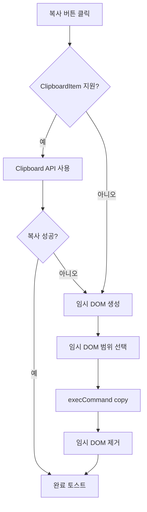

`document.execCommand('copy')`는 현대 웹 표준에서는 구형 방식이지만, fallback으로 사용할 수 있습니다.

---

## 20. 복사 완료 토스트

복사 성공 시 화면 하단에 짧은 알림을 표시합니다.

개념 예시:

```js
function showToast() {
  const toast = document.getElementById('toast');

  toast.classList.add('show');

  setTimeout(() => {
    toast.classList.remove('show');
  }, 2500);
}
```

### 20.1 역할

- 사용자가 복사 성공 여부를 확인할 수 있음
- 별도의 팝업을 사용하지 않아 작업 흐름을 방해하지 않음
- 일정 시간이 지나면 자동으로 사라짐

---

## 21. 초기화 로직

각 탭에는 해당 탭의 입력값과 체크박스를 기본 상태로 되돌리는 초기화 함수가 있습니다.

일반적인 초기화 과정은 다음과 같습니다.

1. 텍스트 입력 필드 비우기
2. 체크박스 선택 해제
3. 체크박스 라벨의 `checked` 클래스 제거
4. 조건부 입력 필드 비활성화
5. 해당 탭 렌더링 함수 재호출

개념 예시:

```js
function resetTemplate() {
  document
    .querySelectorAll('#tab-example input[type="text"]')
    .forEach(input => {
      input.value = '';
    });

  document
    .querySelectorAll('#tab-example input[type="checkbox"]')
    .forEach(checkbox => {
      checkbox.checked = false;
    });

  document
    .querySelectorAll('#tab-example .checkbox-group')
    .forEach(label => {
      label.classList.remove('checked');
    });

  updateTemplate();
}
```

### 21.1 초기화 흐름


---

## 22. 초기 렌더링

페이지를 처음 열었을 때 모든 이메일 본문 영역이 비어 있지 않도록 각 렌더링 함수를 한 번씩 호출합니다.

개념 예시:

```js
updatePA();
updateCU();
updateINV();
updateBOND();
updateDOA();
```

### 22.1 초기 렌더링의 목적

- 첫 화면에서 기본 이메일 구조 표시
- 입력 전 placeholder 확인 가능
- 탭 전환 시 비어 있는 화면 방지
- 각 템플릿의 기본 DOM 상태 정리
- DOA 고정 문구 즉시 출력

---

## 23. 이벤트 기반 업데이트

Template Engine은 사용자 입력 이벤트를 기준으로 동작합니다.

다음 이벤트가 발생하면 해당 Template Renderer가 다시 실행됩니다.

- Text Input
- Checkbox Change
- Language Change
- Template Reset

이를 통해 별도의 저장 과정 없이 항상 최신 이메일 Preview를 제공합니다.

---

## 24. 현재 설계의 장점

현재 템플릿 로직은 다음과 같은 장점을 가집니다.

### 24.1 별도 서버가 필요하지 않음

모든 처리가 브라우저 안에서 이루어집니다.

### 24.2 즉각적인 피드백

입력과 동시에 결과를 확인할 수 있습니다.

### 24.3 이메일 문구 표준화

업무별 고정 템플릿을 사용해 담당자 간 문구 차이를 줄입니다.

### 24.4 조건부 안내 문구

상황에 필요한 안내만 선택적으로 포함할 수 있습니다.

### 24.5 국문/영문 입력값 공유

동일한 입력값으로 두 언어의 이메일을 생성할 수 있습니다.

### 24.6 Outlook 호환성

HTML 복사 방식을 통해 이메일 서식을 유지할 수 있습니다.

### 24.7 확장 가능한 탭 구조

동일한 패턴으로 새로운 이메일 유형을 추가할 수 있습니다.

---

## 25. 현재 설계의 한계

단일 HTML 기반 구조는 초기 사용에는 효율적이지만, 프로젝트가 커질수록 다음과 같은 한계가 발생할 수 있습니다.

### 25.1 템플릿과 로직의 결합

이메일 문구가 JavaScript 문자열 안에 직접 포함되어 있어 문구 수정과 로직 수정이 분리되지 않습니다.

### 25.2 코드 중복

국문과 영문 렌더링 함수에 유사한 구조가 반복될 수 있습니다.

### 25.3 테스트 자동화 부족

브라우저에서 수동으로 체크박스 조합과 입력값을 검증해야 합니다.

### 25.4 날짜 연도 고정

코드에 특정 연도가 포함되어 있어 장기 운영 시 수정이 필요합니다.

### 25.5 입력값 검증 부족

잘못된 날짜 형식, 필수 입력값 누락, 충돌하는 체크박스 조합을 엄격하게 차단하지 않습니다.

### 25.6 데이터 연동 없음

현재 버전은 모든 입력값을 사용자가 직접 입력하는 독립형 웹앱으로 구성되어 있습니다.

Repository에 포함되는 예시 화면과 사용 방법은 샘플 데이터를 기준으로 설명하며, 향후 Progress Sheets와 연계하면 동일한 입력값을 시트에서 자동으로 전달받을 수 있습니다.

---

## 26. 확장 가능성

현재 Template Engine은 사용자 입력을 기반으로 동작하지만, 입력 데이터와 렌더링 로직을 분리하여 설계했습니다.

이를 통해 향후 Progress Sheets와 같은 외부 데이터 소스를 연결하더라도 동일한 Template Renderer를 재사용할 수 있습니다.

확장 구조와 시스템 설계는 **system-architecture.md**에서 설명합니다.

---

## 27. 입력 검증 개선 방향

향후에는 이메일 생성 전에 입력값과 선택 항목을 검증할 수 있습니다.

### 27.1 필수값 검증

예시:

- PRE-ALERT: 화주명, BL 번호, ETA
- 본드 갱신: 수입자명, 만료일
- 배송지 확인: 주소 또는 정보 요청 옵션

### 27.2 날짜 검증

- `MM/DD` 형식 확인
- 유효한 월과 일 확인
- 실제 존재하는 날짜 확인
- 과거 또는 미래 날짜 여부 확인

### 27.3 선택 조합 검증

- 배송과 픽업 동시 선택 확인
- 배송지 문의와 보유 정보 확인 동시 선택 확인
- RPP 선택 시 CARM 선행 여부 확인
- DOA 상태와 POA 상태 연계 확인

### 27.4 검증 흐름

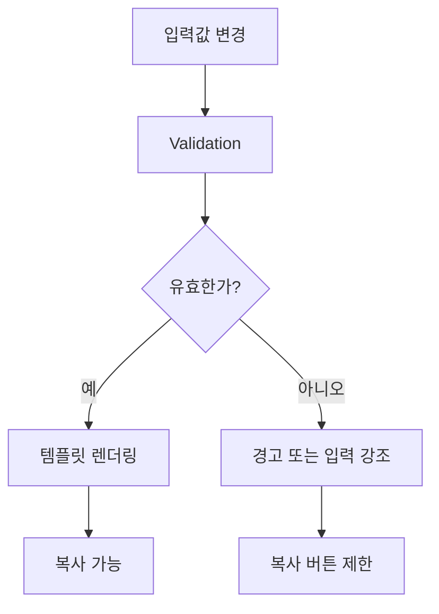

---

## 28. 테스트 시나리오

Template Engine은 다음과 같은 상황을 기준으로 검증했습니다.

- 입력값 누락
- 날짜 변환
- 언어 전환
- 체크박스 조합
- Outlook HTML 복사

각 이메일 유형은 동일한 Rendering Pipeline을 사용하므로 동일한 검증 절차를 적용할 수 있습니다.

---

## 29. 샘플 데이터 및 기능 재현

본 Repository에서는 프로젝트의 작동 방식과 주요 기능을 직접 확인할 수 있도록 샘플 데이터를 사용합니다.

샘플 데이터는 실제 운송 업무에서 사용되는 정보 구조를 반영하되, 누구나 프로젝트의 기능을 이해하고 테스트할 수 있도록 일반적인 값으로 구성했습니다.

샘플 데이터는 다음 기능을 재현하고 검증하는 데 사용됩니다.

- 입력값에 따른 이메일 제목 및 본문 실시간 생성
- ETA와 갱신일의 날짜 형식 변환
- 국문 및 영문 템플릿 전환
- 체크박스 조합에 따른 조건부 안내 문구 삽입
- 주소와 연락처 등 입력값의 이메일 본문 반영
- Outlook에 붙여넣을 수 있는 HTML 형식 복사
- 탭별 초기화 및 화면 전환
- 이메일 유형별 고정 문구와 선택 문구의 조합
- 입력값 유지 상태에서의 언어 전환
- 복사 완료 토스트와 fallback 복사 기능

### 29.1 샘플 데이터 구성

기능 확인에 사용할 수 있는 예시 데이터는 다음과 같습니다.

```text
Shipper: SAMPLE EXPORTER
Importer: SAMPLE IMPORTER
House BL#: SAMPLE26001
Vancouver ETA: 7/15
Warehouse ETA: 7/22
Delivery Address: 123 Sample Street, Vancouver, BC
Contact Number: 604-000-0000
Bond Renewal Date: 8/1
```

각 값은 앱 내 입력 필드와 템플릿 변수의 작동 방식을 보여주기 위한 예시입니다.

| 샘플 데이터 | 사용 위치 |
|---|---|
| `SAMPLE EXPORTER` | PRE-ALERT 화주명 |
| `SAMPLE IMPORTER` | 본드 갱신 수입자명 |
| `SAMPLE26001` | PRE-ALERT House BL 번호 |
| `7/15` | 밴쿠버 ETA |
| `7/22` | 창고 ETA |
| `123 Sample Street, Vancouver, BC` | 통관 완료 안내 배송지 주소 |
| `604-000-0000` | 통관 완료 안내 연락처 |
| `8/1` | 본드 갱신일 |

---

### 29.2 탭별 기능 재현

샘플 데이터를 입력하면 각 탭에서 다음 기능을 확인할 수 있습니다.

| 탭 | 확인 가능한 기능 |
|---|---|
| PRE-ALERT | 화주명, BL 번호, ETA 및 선택 안내 항목 반영 |
| 통관 완료 안내 | 배송지 정보 요청 또는 기존 정보 확인 문구 생성 |
| 운송 인보이스 안내 | 통관, 배송 및 픽업 조건별 문구 조합 |
| 본드 갱신 안내 | 수입자명과 갱신일을 반영한 제목 및 본문 생성 |
| DOA 승인 안내 | 국문 및 영문 고정 안내문 확인 및 복사 |

---

## 30. 요약

본 앱의 템플릿 로직은 사용자의 입력값, 체크박스 상태, 선택된 이메일 유형 및 언어를 조합하여 이메일 제목과 본문을 실시간으로 생성하는 구조입니다.

각 이메일 유형은 독립적인 렌더링 함수를 사용하며, 국문과 영문 템플릿을 별도로 제공합니다.

날짜 포맷 함수는 간단한 날짜 입력을 이메일에 적합한 형식으로 변환하고, 조건부 문구 로직은 고객 상황에 필요한 안내만 선택적으로 포함합니다.

Clipboard API를 통해 HTML과 plain text 형식을 함께 복사함으로써 Outlook에 붙여넣을 때 볼드, 밑줄, 줄바꿈 등의 서식을 유지할 수 있습니다.

현재 구조는 단일 HTML 기반의 경량 내부 도구에 적합하며, 향후에는 템플릿 데이터 분리, 순수 함수 기반 렌더링, 입력 검증, 자동 테스트 및 Progress Sheets 연계를 통해 확장할 수 있습니다.

장기적으로는 현재의 템플릿 렌더링 로직을 독립적인 이메일 생성 엔진으로 분리하고, Progress Sheets의 주요 운송 및 통관 마일스톤을 기반으로 Outlook 이메일 드래프트를 자동 생성하는 구조로 발전시키는 것이 목표입니다.

Repository에 포함된 샘플 데이터와 사용 예시는 방문자가 각 템플릿의 입력, 조건부 문구 생성, 언어 전환 및 Outlook 복사 기능을 직접 재현할 수 있도록 구성했습니다.