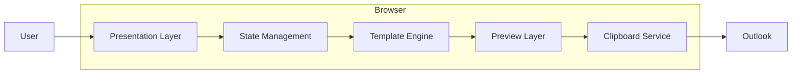
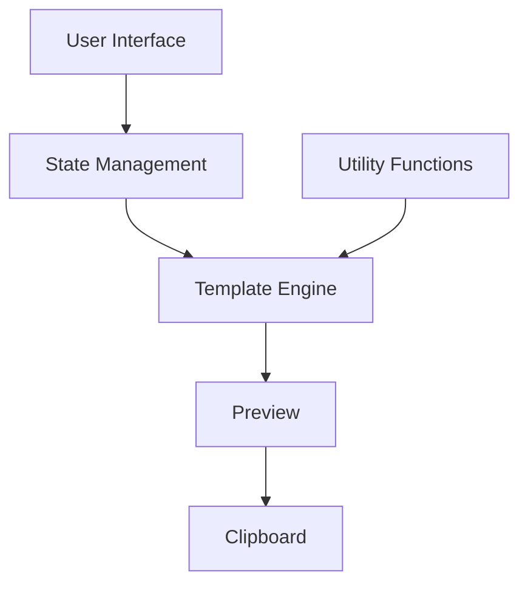
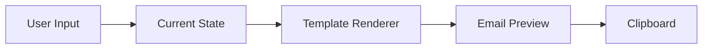
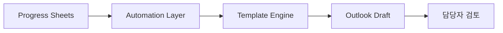
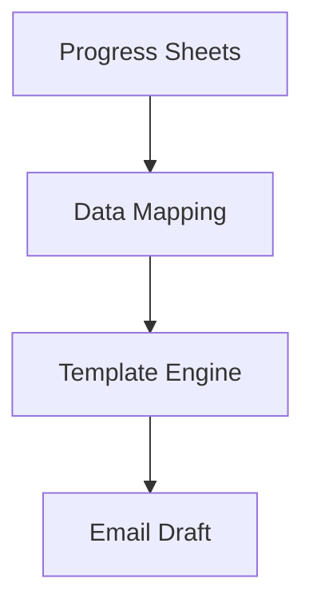
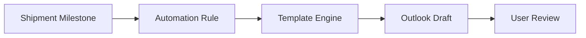

# 시스템 아키텍처

## 1. 개요

Email Draft Generator는 반복적으로 작성되는 운송 및 통관 안내 이메일을 빠르고 일관되게 생성하기 위해 설계한 브라우저 기반 웹 애플리케이션입니다.

현재 버전은 별도의 서버나 데이터베이스 없이 브라우저에서 모든 기능을 수행하는 Client-side Architecture를 채택했습니다. 이메일 생성에 필요한 입력, 상태 관리, 템플릿 렌더링 및 Outlook 복사까지 모든 과정이 하나의 애플리케이션 안에서 이루어집니다.

이러한 구조를 선택한 이유는 다음과 같습니다.

- 별도의 설치 과정 없이 즉시 사용할 수 있는 업무 도구
- 서버 구축 및 유지 비용 없이 운용 가능
- 빠른 응답 속도와 단순한 배포
- 단일 HTML 파일만으로 팀원 간 공유 가능
- 향후 Progress Sheets 및 Outlook 자동화와 자연스럽게 연계 가능한 구조

현재 프로젝트는 이메일 템플릿 생성에 집중되어 있으며, 이후에는 운송 진행 상황을 기반으로 Outlook Draft를 자동 생성하는 구조까지 확장하는 것을 목표로 설계했습니다.

---

# 2. 설계 원칙

프로젝트는 다음과 같은 원칙을 기준으로 설계했습니다.

## 2.1 Browser-first

모든 기능은 브라우저에서 실행됩니다.

사용자는 별도의 설치나 서버 연결 없이 HTML 파일만으로 동일한 기능을 사용할 수 있습니다.

---

## 2.2 Single Responsibility

각 구성 요소는 하나의 역할만 담당하도록 설계했습니다.

예를 들어,

- 사용자 입력은 UI에서 처리하고
- 이메일 생성은 Template Engine에서 수행하며
- 복사는 Clipboard Service에서 담당합니다.

이러한 구조는 기능 수정 시 다른 영역에 미치는 영향을 최소화합니다.

---

## 2.3 Template-driven

사용자가 이메일를 직접 작성하는 대신 템플릿을 기반으로 생성하도록 구성했습니다.

입력값과 선택 옵션만 변경하면 동일한 품질과 형식의 이메일를 일관되게 생성할 수 있습니다.

---

## 2.4 Reusability

동일한 입력 데이터를 여러 템플릿에서 재사용할 수 있도록 설계했습니다.

예를 들어 하나의 화주 정보와 ETA를 기반으로 국문과 영문 이메일를 각각 생성할 수 있으며, 향후 외부 데이터와 연계하더라도 동일한 템플릿을 사용할 수 있습니다.

---

## 2.5 Extensibility

현재는 브라우저 내부에서만 동작하지만, 이후에는 Progress Sheets, n8n 및 Outlook 자동화와 연결할 수 있도록 입력 데이터와 템플릿 생성 로직을 분리하는 방향으로 설계를 고려했습니다.

---

# 3. 전체 시스템 구조

현재 시스템은 다섯 개의 주요 계층으로 구성됩니다.

각 계층은 독립적인 역할을 수행하며, 단방향 데이터 흐름을 유지하도록 구성했습니다.

---

# 4. 계층 구조

## 4.1 Presentation Layer

Presentation Layer는 사용자가 직접 상호작용하는 화면입니다.

주요 역할은 다음과 같습니다.

- 이메일 유형 선택
- 언어 선택
- 입력값 작성
- 옵션 선택
- 이메일 미리보기
- 복사 및 초기화

사용자의 모든 작업은 Presentation Layer에서 시작됩니다.

---

## 4.2 State Management

State Management는 현재 애플리케이션의 상태를 관리합니다.

관리 대상은 다음과 같습니다.

| State | 설명 |
|--------|------|
| Current Template | 현재 선택된 이메일 유형 |
| Current Language | 국문 / 영문 |
| Input Values | 입력 데이터 |
| Checkbox States | 선택 옵션 |

입력 상태가 변경되면 해당 상태를 기반으로 Template Engine이 다시 실행됩니다.

---

## 4.3 Template Engine

Template Engine은 프로젝트의 핵심 계층입니다.

입력 데이터와 선택 옵션을 조합하여 이메일 제목과 본문을 생성합니다.

Template Engine의 내부 동작과 렌더링 과정은 [03_template-logic.md](template-logic.md)에서 자세히 설명합니다.

---

## 4.4 Preview Layer

Preview Layer는 Template Engine이 생성한 결과를 사용자에게 표시합니다.

입력값이 변경될 때마다 Preview가 즉시 갱신되므로 별도의 저장 과정 없이 결과를 확인할 수 있습니다.

---

## 4.5 Clipboard Service

Clipboard Service는 생성된 이메일를 Outlook에서 바로 사용할 수 있도록 HTML 형식으로 복사합니다.

HTML과 Plain Text를 함께 제공하여 다양한 브라우저 환경에서도 안정적으로 사용할 수 있도록 구성했습니다.

복사 방식의 세부 구현은 [03_template-logic.md](template-logic.md)에서 설명합니다.

---

# 5. 컴포넌트 구성

프로젝트는 다음과 같은 주요 컴포넌트로 구성됩니다.

각 컴포넌트는 단일 방향으로만 의존성을 가지며, 순환 참조가 발생하지 않도록 구성했습니다.

---

## 5.1 User Interface

사용자의 입력을 수집하고 이벤트를 발생시키는 역할을 수행합니다.

대표적인 구성 요소는 다음과 같습니다.

- 입력 필드
- 체크박스
- 언어 선택
- 탭
- 복사 버튼
- 초기화 버튼

---

## 5.2 Utility Functions

공통으로 사용하는 기능을 별도의 Utility 함수로 분리했습니다.

대표적인 기능은 다음과 같습니다.

- 날짜 형식 변환
- 문자열 처리
- HTML Escape
- 공통 Helper 함수

이를 통해 Template Renderer가 특정 기능에 의존하지 않고 필요한 기능만 사용할 수 있도록 구성했습니다.

---

## 5.3 Template Engine

각 이메일 유형은 독립적인 Renderer를 사용합니다.

현재 구현된 템플릿은 다음과 같습니다.

- PRE-ALERT
- Customs Completed
- Transportation Invoice
- Bond Renewal
- DOA Approval

Renderer는 동일한 구조를 유지하면서 이메일 유형별 입력값과 문장을 조합하여 결과를 생성합니다.

세부 처리 과정은 [03_template-logic.md](template-logic.md)에서 확인할 수 있습니다.

---

# 6. 데이터 흐름

현재 프로젝트의 데이터 흐름은 단방향 구조를 사용합니다.

사용자가 입력한 데이터는 현재 상태를 갱신하고, Template Renderer가 새로운 이메일를 생성한 뒤 Preview와 Clipboard에 전달됩니다.

단방향 데이터 흐름을 유지함으로써 상태 변경 과정을 추적하기 쉽고, 각 계층 간 의존성을 최소화할 수 있도록 설계했습니다.

---

# 7. 현재 시스템 구조

현재 프로젝트는 브라우저 내부에서 모든 기능을 수행하는 독립형 웹 애플리케이션으로 구현했습니다.

현재 구조의 특징은 다음과 같습니다.

- 별도의 서버 없이 브라우저에서 실행
- 데이터베이스 미사용
- API 호출 없이 동작
- 설치 과정 없이 즉시 사용 가능
- 이메일 생성부터 복사까지 하나의 애플리케이션에서 처리

이 구조는 반복적인 이메일 작성 업무를 빠르게 표준화하고, 누구나 동일한 환경에서 사용할 수 있도록 설계했습니다.

---

# 8. 향후 확장 구조

현재는 사용자가 직접 데이터를 입력하지만, 향후에는 운송 진행 데이터를 기반으로 이메일 초안을 자동 생성하는 구조로 확장할 계획입니다.

현재 구현된 Template Engine은 입력 데이터와 렌더링 로직을 분리하는 방향으로 설계했기 때문에, 향후 자동화 환경에서도 동일한 템플릿을 재사용할 수 있습니다.

---

# 9. Progress Sheets 연계

현재 버전에서는 모든 데이터를 사용자가 직접 입력합니다.

향후에는 Progress Sheets의 운송 진행 정보를 기반으로 이메일 생성에 필요한 데이터를 자동으로 전달받을 수 있도록 확장할 계획입니다.

예상되는 데이터 매핑은 다음과 같습니다.

| Progress Sheets | Template Variable |
|-----------------|------------------|
| Exporter | Shipper |
| Importer | Importer |
| House BL# | BL Number |
| Vessel ETA | ETA |
| Warehouse ETA | Warehouse ETA |
| Delivery Address | Address |
| Contact Number | Contact |
| Bond Expiry Date | Renewal Date |

이와 같은 구조를 적용하면 Template Engine은 입력 방식만 변경될 뿐 동일한 생성 로직을 그대로 사용할 수 있습니다.

---

## 9.1 데이터 흐름

현재 프로젝트에서는 사용자가 직접 입력하는 데이터를 기준으로 동작하지만, 향후에는 Mapping Layer가 동일한 형태의 데이터를 Template Engine으로 전달하는 역할을 수행하게 됩니다.

---

# 10. Outlook Draft 자동화

현재 프로젝트는 이메일 초안을 생성한 뒤 Outlook으로 복사하여 사용하는 방식입니다.

향후에는 Outlook Draft 생성까지 자동화하는 구조를 목표로 하고 있습니다.

자동 발송이 아닌 **Draft 생성**을 목표로 하는 이유는 운송 및 통관 업무에서는 예외 상황이 자주 발생하기 때문입니다.

담당자가 생성된 초안을 검토한 후 발송하는 구조를 유지함으로써 업무 효율성과 정확성을 함께 확보할 수 있습니다.

---

# 11. 확장 가능성

현재 구조에서는 새로운 이메일 유형을 추가하더라도 기존 구조를 크게 변경할 필요가 없습니다.

향후 확장 가능한 기능은 다음과 같습니다.

- 이메일 템플릿 추가
- 다국어 지원 확대
- Progress Sheets 연계
- Outlook Draft 자동 생성
- Microsoft Graph API 연계
- Power Automate 연계
- n8n Workflow 연계
- 이메일 생성 이력 관리

현재의 Layer 구조를 유지하면서 Template Renderer를 추가하는 방식으로 기능을 확장할 수 있습니다.

---

# 12. 기술 선택

프로젝트에서 사용한 주요 기술과 선택 이유는 다음과 같습니다.

| 기술 | 선택 이유 |
|------|-----------|
| HTML | 설치 없이 실행 가능한 UI 구성 |
| CSS | 가볍고 유지보수가 쉬운 스타일 구성 |
| Vanilla JavaScript | Framework 없이 빠른 구현 및 배포 |
| Clipboard API | Outlook 서식 유지 |
| Mermaid | 시스템 구조 문서화 |
| Markdown | GitHub 기술 문서 작성 |

프로젝트 규모와 목적을 고려하여 최소한의 기술 스택으로 구현했으며, 업무 도구로서 빠른 실행과 유지보수성을 우선했습니다.

---

# 13. 주요 설계 결정

프로젝트를 진행하면서 다음과 같은 설계 원칙을 적용했습니다.

| 설계 결정 | 적용 목적 |
|-----------|-----------|
| 단일 HTML 구조 | 설치 및 배포 단순화 |
| Browser-first | 서버 의존성 제거 |
| Client-side Rendering | 빠른 응답 속도 |
| Template 기반 생성 | 이메일 품질 표준화 |
| Layer 분리 | 역할별 책임 명확화 |
| Utility 함수 분리 | 코드 재사용성 향상 |
| HTML Clipboard | Outlook 호환성 확보 |

각 설계 결정은 현재 구현뿐 아니라 향후 자동화 확장까지 고려하여 선택했습니다.

---

# 14. 아키텍처 요약

Email Draft Generator는 반복적으로 작성되는 운송 및 통관 안내 이메일을 표준화하기 위해 설계한 브라우저 기반 웹 애플리케이션입니다.

시스템은 Presentation Layer, State Management, Template Engine, Preview Layer 및 Clipboard Service로 구성되며, 각 계층이 하나의 책임만 수행하도록 설계했습니다.

Template Engine은 입력 데이터와 선택 옵션을 기반으로 이메일 제목과 본문을 생성하는 핵심 모듈이며, 현재는 브라우저에서 직접 입력한 데이터를 사용하지만 향후 Progress Sheets 및 Outlook 자동화에서도 동일한 구조를 재사용할 수 있도록 확장성을 고려했습니다.

현재 프로젝트는 반복 업무를 줄이고 이메일 품질을 표준화하는 생산성 도구로 활용하고 있으며, 장기적으로는 운송 진행 관리와 고객 커뮤니케이션을 연결하는 자동화 워크플로우의 핵심 구성 요소로 발전시키는 것을 목표로 합니다.