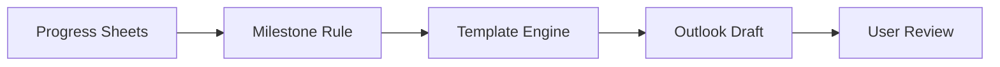
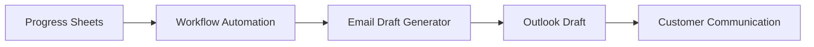

# 향후 개발 계획 (Future Roadmap)

## 1. 개요

Email Draft Generator는 현재 반복적으로 작성되는 운송 및 통관 안내 이메일를 빠르고 일관되게 생성하기 위한 브라우저 기반 웹 애플리케이션으로 구현되어 있습니다.

현재 버전은 독립적으로 사용할 수 있는 생산성 도구에 초점을 맞추고 있으며, 장기적으로는 운송 진행 관리와 고객 커뮤니케이션을 연결하는 자동화 워크플로우의 일부로 확장하는 것을 목표로 합니다.

본 문서는 현재 프로젝트를 기반으로 계획하고 있는 주요 확장 방향을 정리합니다.

---

# 2. 개발 방향

향후 개발은 다음 네 가지 방향을 중심으로 진행할 계획입니다.

- 이메일 템플릿 확장
- 데이터 자동 연계
- Outlook 자동화
- 업무 자동화 워크플로우 구축

---

# 3. 이메일 템플릿 확장

현재는 실제 업무에서 가장 자주 사용하는 이메일 유형을 중심으로 구현했습니다.

향후에는 추가적인 업무 상황에 대응할 수 있도록 템플릿을 지속적으로 확장할 계획입니다.

예상되는 추가 템플릿은 다음과 같습니다.

- Delivery Appointment
- Cargo Delay Notice
- Customs Hold
- POD Request
- Arrival Confirmation
- Exception Handling Notice

새로운 템플릿도 기존 Template Engine을 재사용하여 동일한 사용자 경험을 유지하도록 구성할 예정입니다.

---

# 4. Progress Sheets 연계

현재 버전에서는 사용자가 직접 입력한 데이터를 기반으로 이메일를 생성합니다.

향후에는 Progress Sheets 자동화 프로젝트와 연계하여 운송 진행 정보를 자동으로 불러오는 기능을 추가할 계획입니다.

예상되는 연계 항목은 다음과 같습니다.

| Progress Sheets | 활용 목적 |
|-----------------|-----------|
| Exporter | 화주 정보 |
| Importer | 수입자 정보 |
| House BL# | 운송 정보 |
| ETA | 일정 안내 |
| Warehouse ETA | 창고 일정 |
| Delivery Address | 배송 안내 |
| Contact Number | 연락처 |
| Bond Expiry | 갱신 안내 |

이를 통해 반복 입력을 최소화하고 담당자의 업무 부담을 줄일 수 있습니다.

---

# 5. Outlook Draft 자동화

현재는 생성된 이메일를 Outlook으로 복사하여 사용하는 방식입니다.

향후에는 Outlook Draft를 자동으로 생성하는 기능을 구현하는 것을 목표로 하고 있습니다.

예상되는 Workflow는 다음과 같습니다.

자동 발송이 아닌 Draft 생성을 목표로 하는 이유는 담당자의 최종 검토 과정을 유지하기 위해서입니다.

---

# 6. 업무 자동화 확대

Email Draft Generator는 단독으로도 활용할 수 있지만, 다른 자동화 프로젝트와 연계할 때 더욱 큰 효과를 기대할 수 있습니다.

현재 고려 중인 연계 대상은 다음과 같습니다.

- Progress Sheets 자동화
- n8n Workflow
- Microsoft Graph API
- Power Automate

이와 같은 자동화를 통해 운송 진행 상황에 따라 필요한 이메일를 적절한 시점에 생성하는 구조를 목표로 합니다.

---

# 7. 사용자 경험 개선

향후에는 기능 추가뿐 아니라 사용성 개선도 지속적으로 진행할 계획입니다.

예상되는 개선 사항은 다음과 같습니다.

- 최근 입력값 기억
- 자주 사용하는 옵션 저장
- 템플릿 검색 기능
- 키보드 단축키 지원
- 다크 모드
- 모바일 화면 최적화

실제 업무에서 반복되는 클릭과 입력을 줄이는 방향으로 개선을 진행할 예정입니다.

---

# 8. 다국어 지원 확대

현재는 국문과 영문을 지원합니다.

향후에는 프로젝트 활용 범위를 고려하여 추가 언어 지원도 검토할 계획입니다.

가능한 언어는 다음과 같습니다.

- French
- Chinese
- Japanese

새로운 언어도 동일한 Template Engine을 재사용하여 관리할 수 있도록 설계하는 것을 목표로 합니다.

---

# 9. 프로젝트 확장 방향

장기적으로는 Email Draft Generator를 독립적인 이메일 작성 도구가 아니라 운송 진행 관리 플랫폼의 일부로 발전시키는 것을 목표로 합니다.

현재 프로젝트는 위 구조에서 이메일 생성 엔진의 역할을 수행하도록 설계했습니다.

---

# 10. Roadmap

| Phase | 목표 | 상태 |
|--------|------|------|
| Phase 1 | 이메일 템플릿 생성 | ✅ 완료 |
| Phase 2 | Outlook 호환 복사 | ✅ 완료 |
| Phase 3 | 다국어 지원 | ✅ 완료 |
| Phase 4 | Progress Sheets 연계 | 🔄 계획 |
| Phase 5 | Outlook Draft 자동 생성 | 🔄 계획 |
| Phase 6 | Workflow 자동화 | 🔄 계획 |

---

# 11. 마무리

현재 프로젝트는 반복적인 이메일 작성 업무를 줄이고 고객 안내 품질을 표준화하기 위한 생산성 도구로 활용할 수 있습니다.

향후에는 Progress Sheets 자동화 프로젝트와 연계하여 운송 진행 정보를 기반으로 필요한 이메일를 자동 생성하고, Outlook Draft까지 연결하는 자동화 워크플로우를 구축하는 것을 목표로 하고 있습니다.

이를 통해 반복 입력을 최소화하면서도 담당자의 최종 검토 과정을 유지하는 실무 중심의 이메일 자동화 환경을 구현하고자 합니다.